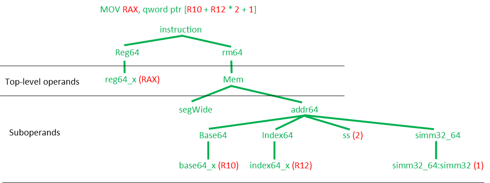
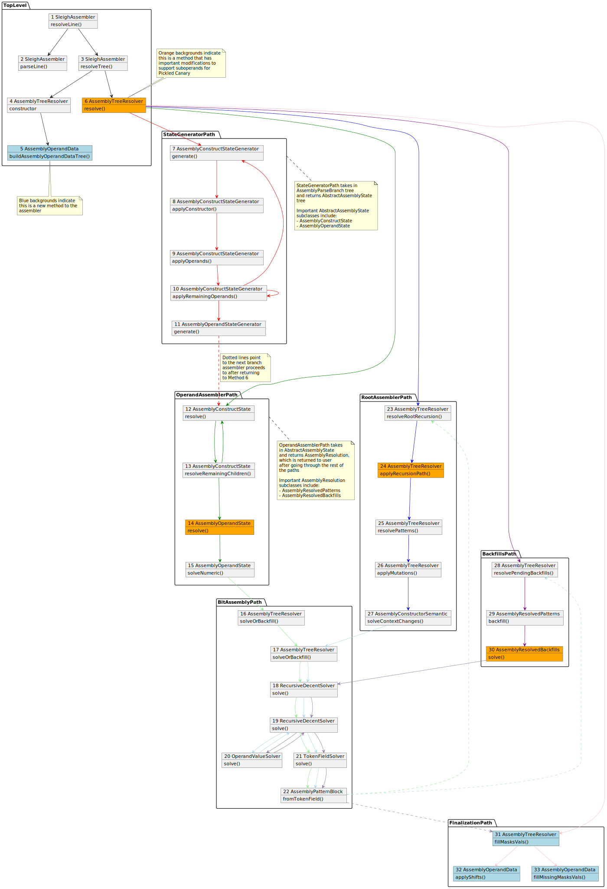
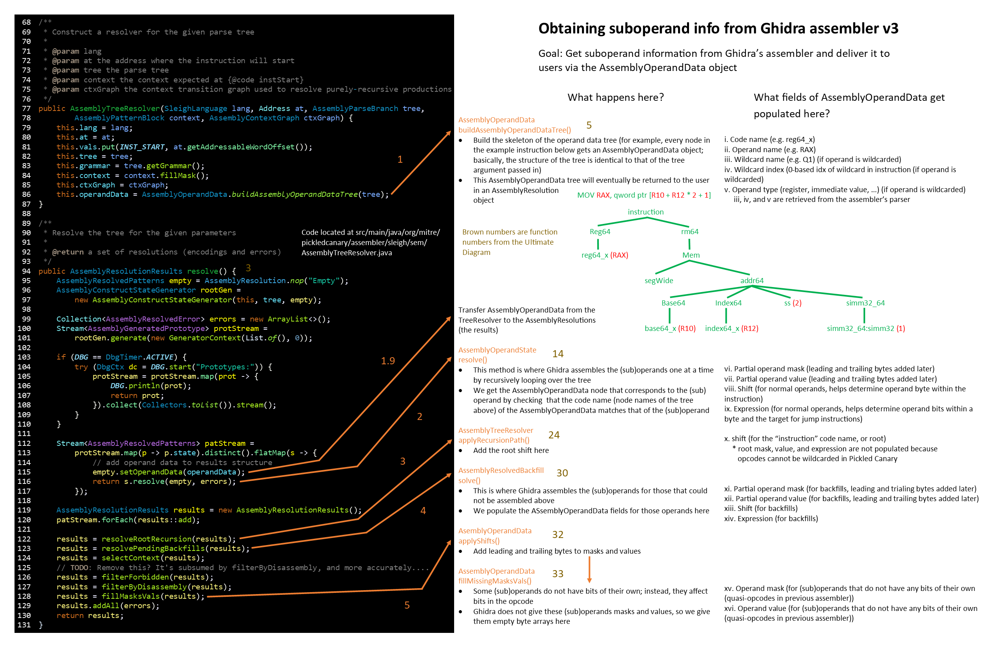

# The New Ghidra Assembler and Modifications

## Introduction

Ghidra is a reverse engineering tool used to disassemble binaries. Despite being a disassembler, Ghidra includes an assembler package (located at `ghidra.app.plugin.assembler`) as well, to allow for patching. Pickled Canary is a binary searching tool that mainly relies on Ghidra’s assembler package to assemble its patterns. However, the assembler package does not provide Pickled Canary with everything that is needed. As a result, the assembler package was modified to expose the necessary information required for Pickled Canary to function. In this article, we will describe the needs of Pickled Canary, the current state of Ghidra’s assembler, and the inner workings of the modified assembler.

## Pickled Canary Needs

Pickled Canary allows users to write several types of patterns. One such pattern includes wildcards; for example ``MOV RBX, qword ptr [`Q1/.*` + R12 * 2 + 1]``. The `` `Q1/.*` `` is a wildcard that tells Pickled Canary to replace the wildcard with an operand that will make a valid assembly instruction. Pickled Canary will obtain the encodings of all the valid assembly instructions to create a compiled pattern that users can use to search binaries. When Pickled Canary is searching binaries and comes across a match, it will tell the user the operand that `` `Q1/.*` `` replaced. In order for this to happen, Pickled Canary must have a map between an operand and the binary encoding of the operand. For example, if `R10` represents `` `Q1/.*` ``, then the full instruction is `MOV RBX, qword ptr [R10 + R12 * 2 + 1]`, and the binary encoding would be:

```
Mask:  11111111 11111111 11111111 11111111 11111111
Value: 01001011 10001011 01000100 01100010 00000001
```

And the bits that make up `R10`, which Pickled Canary needs to obtain from Ghidra, would be:

```
Mask:  00000000 00000000 00000000 00000111 00000000
Value: 00000000 00000000 00000000 00000010 00000000
```

## Current Ghidra Assembler

Several methods from the assembler package can be called to assemble a line of assembly, such as `assembleLine` or `resolveLine {1}`. Note: methods with a {#} refer to the function numbers that are listed in Figure 2.

The `assembleLine` method returns the most appropriate byte code given a context, whereas `resolveLine {1}` returns a list of binary representations that the line of assembly could resolve to. The user receives an `AssemblyResolutionResults` object when `resolveLine {1}` is called. `AssemblyResolutionResults` contain a `Set` of `AssemblyResolution`, which is Ghidra’s class to represent several types of assembly results, one of which is a single binary representation (the class of which is named `AssemblyResolvedPatterns`). Given an `AssemblyResolvedPatterns` object, users can call the `getInstruction` method to get the `AssemblyPatternBlock` object that contains the mask (`getMask` method) and value (`getVals` method) of the binary representation of the entire instruction.
It is also possible to obtain the masks and values of the individual top-level operands of an instruction. For example, in the instruction `MOV RBX, qword ptr [R10 + R12 * 2 + 1]`, users can obtain the masks and values for `MOV`, `RBX`, and `qword ptr [R10 + R12 * 2 + 1]`. However, there does not currently appear to be a way to obtain the masks and values of the individual suboperands, or what Ghidra calls “sub-table operands” (i.e. the masks and values cannot be retrieved for `R10` or `R12`).

## Modified Assembler

We fix the issue presented in the previous section by modifying Ghidra’s assembler to expose the masks and values of suboperands, amongst other information.

### Instruction Tree

First, we must understand the instruction tree that Ghidra uses internally in the assembler to help assemble an instruction. This tree structure can be seen in `AssembleParseTreeNode` along with its subclasses and as well as `AbstractAssemblyState` along with its subclasses (we will discuss the roles of these classes in a later section). Using our instruction example, the tree looks like:



Figure 1. An example instruction tree that we must traverse to obtain suboperand information.

Each of the green words are the code names that represent a node in the instruction tree (“code name” is probably not the official term used by the Ghidra developers). As one can notice, individual (sub)operands build up to form the instruction. The information for each sub(operand) exists at its corresponding nodes, but as the information travels up the tree to parent nodes, the information of all the children is combined. Therefore, to obtain the masks and values of the suboperands, we must traverse this tree and extract the information at the leaves of the tree. (As a note, the structure and code names of the tree will change depending on the language and structure of the instruction. However, the method of traversing the tree to extract information remains the same.)

### Results Class

Once the information is extracted from the tree, we need a way to return the information to users. We created a class named `AssemblyOperandData`, as the vessel for this information. An instance of an `AssemblyOperandData` class contains information about a node in the instruction tree as well as a list of `AssemblyOperandData` to represent child nodes, making up an `AssemblyOperandData` tree. As mentioned above, assembly results are returned as `AssemblyResolution` objects. We modified `AssemblyResolution` to hold an `AssemblyOperandData` tree, so that our results can be returned to users. Below is a listing of information that `AssemblyOperandData` provides:

Table 1. A list of information that the `AssemblyOperandData` class provides users.

| Name           | Method              | Description                                                                                                                                                  |         
| -------------- | ------------------- | ------------------------------------------------------------------------------------------------------------------------------------------------------------ |
| Wildcard name  | `getWildcardName()` | Wildcard symbol from Pickled Canary pattern (i.e. `Q1`)                                                                                                      |
| Wildcard index | `getWildcardIdx()`  | Order of the wildcard in the instruction (`Q1` in the example we have been using would have an index of 0 because it is the 0th wildcard in the instruction) |
| Operand type   | `getOperandType()`  | The type of operand (e.g. register)                                                                                                                          |
| Operand name   | `getOperandName()`  | The mnemonic that is used to represent an operand (e.g. `R10`)                                                                                               |
| Code name      | `getCodeName()`     | The internal name that Ghidra uses to name nodes (e.g. `base64_x`)                                                                                           |
| Mask           | `getMask()`         | The mask of the operand                                                                                                                                      |
| Value          | `getVal()`          | The value of the operand                                                                                                                                     |
| Byte shift     | `getByteShift()`    | Number of bytes to shift operand into correct place in an instruction                                                                                        |
| Expression     | `getExpression()`   | Expression used to calculate address of labels and to do certain shifts                                                                                      |
| Children       | `getChildren()`     | The children `AssemblyOperandData` nodes in the tree                                                                                                         |

There is an additional method, `getWildcardOperandData`, that returns a list of all the nodes where the (sub)operand has been wildcarded.

### Changes to Assembler

Several methods have been added and modified. The below diagrams summarize the changes and code flow.



Figure 2. The Ultimate Diagram. Shows the code flow of the modified assembler. (Note: The source code for this diagram can be found at [assemblerCallTraceDiagram.txt](assemblerCallTraceDiagram.txt), and the diagram can be generated by following the instructions at https://plantuml.com/starting.)



Figure 3. A summary of the changes to the assembler and guide of where `AssemblyOperandData` fields are populated.
 
When the user calls `resolveLine {1}`, two methods are called: `parseLine {2}` (which parses an instruction and returns an instruction tree) and `resolveTree {3}` (which assembles the instruction using the tree). For Pickled Canary purposes, Ghidra’s assembler is split into these two parts: the parser (`parseLine {2}`) and the assembler (`resolveTree {3}`), both of which have been modified. This article will mainly go over the assembler portion, but we will touch on the parser portion a little bit as well.

The current `parseLine {2}` method takes in a line of assembly as a string and returns a list of possible trees:

```java
public Collection<AssemblyParseResult> parseLine(String line);
```

This means we can pass in `MOV RBX, qword ptr [R10 + R12 * 2 + 1]` but not ``MOV RBX, qword ptr [`Q1/.*` + R12 * 2 + 1]`` since the latter is not a valid line of assembly. To allow users to pass in wildcards, we created a new method:

```java
public Collection<AssemblyParseResult> parseLine(InstructionNode node, TaskMonitor monitor);
```

`InstructionNode` is a Pickled Canary class that can hold patterns with wildcards. The overloaded method is the start of the parser process that creates an `AssemblyOperandData` for each wildcard and populates it with the wildcard name, wildcard index, and operand type. The `AssemblyParseResult` objects, which each contain one possible path for assembling for one instruction, are passed from the parser portion to the assembler portion and contain the instruction tree. Figure 4 below shows the different classes that can be used to represent nodes in the instruction tree.

```
              ┌─────────────────────┐
              │AssemblyParseTreeNode│
              └──────────┬──────────┘
            ┌────────────┴────────────┐
  ┌─────────┴─────────┐     ┌─────────┴────────┐
  │AssemblyParseBranch│     │AssemblyParseToken│
  └───────────────────┘     └─────────┬────────┘
                         ┌────────────┴────────────┐
           ┌─────────────┴───────────┐  ┌──────────┴─────────┐
           │AssemblyParseNumericToken│  │WhiteSpaceParseToken│
           └─────────────────────────┘  └──────────┬─────────┘
                                    ┌──────────────┴──────────────┐
                                    │TruncatedWhiteSpaceParseToken│
                                    └─────────────────────────────┘
```
Figure 4. The class hierarchy of the instruction tree.

The two important classes are `AssemblyParseBranch` (which represents nodes in the instruction tree with children) and `AssemblyParseNumericToken` (which represents leaves of the tree that are operands). Most operands are represented by `AssemblyParseNumericToken`, but once in a blue moon, the `AssemblyParseToken` class will be used instead. The abstract class `AssemblyParseTreeNode` is where the `AssemblyOperandData` is stored as a protected variable.

When `resolveTree {3}` receives an `AssemblyParseResult`, it creates a `AssemblyTreeResolver` object, which does the heavy lifting of assembling the instruction. The constructor {4} of `AssemblyTreeResolver` calls `buildAssemblyOperandDataTree {5}`, which builds a replica of the instruction tree, except instead of using `AssemblyParseTreeNode` classes, it uses `AssemblyOperandData` classes. The method populates the appropriate instances of the `AssemblyOperandData` with the wildcard name, wildcard index, and operand type using the information that was passed from the parser. This newly built tree will then be passed through the assembler to get the rest of the fields filled in, and then it is returned to users.

After the `AssemblyTreeResolver` is constructed, the `resolve {6}` method of `AssemblyTreeResolver` delegates all the different subtasks of assembling to different methods. A summary of the subtasks follows:
1.	State generation (path with red arrows in Figure 2) – the assembler processes the tree some more to prepare for assembling.
2.	Operand assembly (path with green arrows in Figure 2) – most operands are assembled here.
3.	Root assembly (path with blue arrows in Figure 2) – the opcode is assembled here and the instruction is finished assembling here for most instructions.
4.	Backfills (path with purple arrows in Figure 2) – some operands cannot be assembled during the operand assembly phase, so those get assembled here.
5.	Filtering – remove invalid results by checking context and whether an assembled line can be disassembled to result in the same line of assembly. This subtask is not included in Figure 2 because it is not important in the context of the assembler modifications.
6.	Finalization (path with pink arrows in Figure 2) – this is a completely new task that has been added for Pickled Canary. It performs some final adjustments on the `AssemblyOperandData` tree.
A more in-depth look at each subtask follows.

#### State Generation

The state generation subtask traverses the `AssemblyParseTreeNode` instruction tree. At the `applyRemainingOperands {10}` method, a `generate` method is called, which can be the `generate {7}` method in `AssemblyConstructStateGenerator` to process nodes that have children, or it can be the `generate {11}` method from `AssemblyOperandStateGenerator` to process leaf nodes that represent operands. Out of this processing, a new `AbstractAssemblyState` tree is created, which contains `AssemblyConstructState` objects to represent nodes with children and `AssemblyOperandState` objects to represent the leaves. This new tree is populated with the fields and methods needed to assemble the instruction. More information about this subtask can be found in the JavaDoc for `applyRemainingOperands {10}`.

Note: The `buildAssemblyOperandDataTree {5}` method described in the section above can be implemented in this subtask. Instead of building the `AssemblyOperandData` tree in one recursive method, the tree can be built as this subtask traverses through the `generate` methods. However, we have decided to build the tree over a recursive method to reduce the amount of existing Ghidra code we have to modify and to make the code easier to understand.

#### Operand Assembly

The operand assembly subtask is responsible for traversing the sub(operands) in the `AbstractAssemblyState` tree and assembling each of them. This subtask comprises of two parts: bit placement and byte placement.

Starting in the `resolve {6}` method of `AssemblyTreeResolver`, the code creates an empty `AssemblyResolution` object to fill in with the results of the assembly. We add the `AssemblyOperandData` tree that we created in `buildAssemblyOperandDataTree {5}` to that results object. Next, the assembler traverses through the function calls to the `solveOrBackfill {16}` method, which is where the bit placement portion begins. Here, the assembler hops through a few more methods until it reaches `fromTokenField {22}` in `AssemblyPatternBlock`, where it processes a `TokenField`, a subclass of `PatternExpression`. There appear to be many uses for `PatternExpression`, but the one that we care about in this subtask is that given a 64-bit `MaskedLong` value, it determines the placement of the bits of the operand’s value within byte(s), which is what `fromTokenField {22}` does with the help of a `TokenField`. For example, in our `RBX` operand from the x86_64 instruction from above, a `MaskedLong` value of

```
00000000 00000000 00000000 00000000 00000000 00000000 00000000 00000011
```
is trimmed down to

```
011
```
which are the bits that represent `RBX` in the context of the instruction above. However, when the instruction is assembled, the binary representation is eight bytes long. Which of the bytes and which bits within that byte does the `011` belong in? The `fromTokenField {22}` will take the trimmed down value and shift it within the byte(s) to where it belongs:

```
xx011xxx
```

The final positioning of the bits within the byte(s) is placed in an `AssemblyPatternBlock` object as a mask and value:

```
Mask:  00111000
Value: 00011000
```

The `AssemblyPatternBlock` is then encapsulated in an `AssemblyResolution` object and sent back up the call stack to the `solveNumeric {15}` method in `AssemblyOperandState`. The bit placement part is now complete, and we move on to the byte placement part.

The byte placement begins in `solveNumeric {15}` where a shift is applied. The byte shift actually comprises of two different shifts, which comes from different parts of the processor specification file. One part of the shift was applied in `fromTokenField {22}` when the `getByteStart` method from `TokenField` was called and its value passed into the new `AssemblyPatternBlock` that we discussed in the bit placement section. When the shift method from `AssemblyResolution` is called, an additional shift is added to the shift from the `TokenField`. The sum of these two shifts forms the shift for the (sub)operand that we are processing.

In `resolve {14}`, the result is combined with other operands that have already been assembled. Depending on how the mask and value of the (sub)operand that we were processing aligns with those of the other operands, our (sub)operand could see additional shifts. As the execution assembles and combines more operands and returns back up the tree, the `AssemblyResolution` object begins to look more like the final output of the assembler.

In Pickled Canary though, we do not want to combine the values of the (sub)operands together, so in `resolve {14}`, we add the mask and value from the `AssemblyPatternBlock` to the appropriate node in the `AssemblyOperandData` tree, along with the shift value, so that we can later shift the value without having to combine with other operands (we do not apply the shifts until the last subtask). We also populate the expression field of the `AssemblyOperandData` as well here.

When the `AssemblyResolution` object is returned to `resolve {3}` in `AssemblyTreeResolver`, most of the instruction has been assembled. The root, which appears to be the opcode of the binary encoding (though I am not sure), still needs to be assembled, and it is done so in the next subtask.

#### Root Assembly

The root assembly subtask begins in the `resolveRootRecursion {23}` method. This subtask takes each `AssemblyResolution` produced in the previous subtask and assembles the opcode of the instruction. Because there can be more than one prefix for each `AssemblyResolution`, we pass a copy of the `AssemblyOperandData` tree to each call of `applyRecursionPath {24}`. In `applyRecursionPath {24}`, a shift is set in the root node of the `AssemblyOperandData` tree (but like the previous subtask, the shift is not applied to the (sub)operands until the last subtask). No masks and values need to be added to the `AssemblyOperandData` tree because Pickled Canary currently forbids the opcode from being replaced by a wildcard.

A similar path of bit and byte placement is taken as the previous subtask to assemble to opcode. This subtask returns an almost complete assembly of an instruction.

#### Backfills

Sometimes, an operand cannot be assembled until the rest of the instruction has been assembled. These are called backfill operands, and they are assembled after the root assembly subtask. Like the operand and root assembly, backfills are assembled with bit and byte placement methods. This subtask begins in `resolvePendingBackfills {28}` and calls several methods until it reaches the bit placement methods, as previously discussed (methods 18-22). As execution returns up the call stack, we arrive at the `solve {30}` method of `AssemblyResolvedBackfills` where the mask, value, shift, and expression are populated in the `AssemblyOperandData` tree. At this point, the backfills subtask is finished, and all the `AssemblyOperandData` tree has gathered all the necessary information.

#### Finalization

In the final subtask, we do some final processing on the masks and values in the `AssemblyOperandData` tree. At this point, all the masks and values in the tree are in the correct bit placement within byte(s), but the byte placement within the instruction is not correct. Going back to the example in the Operand Assembly section, `RBX` has a bit placement of

```
Mask:  00111000
Value: 00011000
```

When assembled, the instruction is eight bytes long. Our mask and value need to be eight bytes long, and the byte above needs to be placed in the correct spot. In the first part of the final subtask, `applyShifts {32}`, the shifts that were set to the tree are applied to the masks and values. This method will take each (sub)operand and right shift its mask and value the number of bytes listed in the shift field of each node starting from the (sub)operand node up to the root node. Trailing bytes are added so that the mask and values have the same number of bytes as the assembled instruction.
For example, in our `RBX` example, the operand assembly subtask populated the `RBX` node with a shift of one, and the root assembly subtask also populated the root node with a shift of one. Therefore, the mask and value of the `RBX` node is right shifted twice:

```
Mask:  00000000 00000000 00111000
Value: 00000000 00000000 00011000
```

The instruction is eight bytes long though, so five trailing bytes are added to complete the mask and value fields:

```
Mask:  00000000 00000000 00111000 00000000 00000000 00000000 00000000 00000000
Value: 00000000 00000000 00011000 00000000 00000000 00000000 00000000 00000000
```

In the second part of this final subtask, `fillMissingMasksVals {33}`, (sub)operands with empty masks and values are set to zero. In instructions like `LEA EAX, [ DI + -0x6c ]`, the operand `DI` does not assemble to any bytes on its own. Instead, `DI` affects how the opcode is assembled. In the previous subtasks, `DI` will not be assembled by the assembler, so upon reaching this subtask, its mask and value in its `AssemblyOperandData` node will be empty. The binary representation for the assembled instruction is seven bytes long. Therefore, in this part, the mask and value for `DI` will be filled with seven bytes of zeros. After this part is completed, the subtask is completed as well, and the `AssemblyOperandData` tree is ready for use by users, where users can obtain a list of the wildcarded (sub)operand nodes by calling `getWildcardOperandData`.
