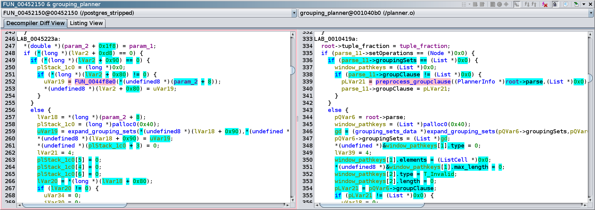
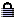

# Evaluating Matches and Applying Information

Summarizing what we've created over the last few sections, we now have:
1. A stripped executable (``postgres``).
1. A Ghidra project containing some object files *with debug information*[^1] used to build that executable.
1. A BSim database containing the BSim signatures of the object files.

[^1]: Having debug information isn't necessary to use BSim (as we've seen in a previous exercise), but it is convenient. Note that applying debug information can change BSim signatures, which can negatively impact matching between functions with debug information and functions without it.
      
We now demonstrate using BSim to help reverse engineer ``postgres``.
While doing this, we'll showcase some of the features available in the decompiler diff view.  

## Exercise: Exploring the Highlights

Import and analyze the stripped `postgres` executable into the tutorial project, then perform the following steps:

1. Select all functions in `postgres` via ``Ctrl-A`` in the Listing.
1. Perform a BSim query of the database ``example``.
    - **Note:** We use the results of this query in the following few exercises. 
    If you don't close the BSim search results window, you won't have to issue the query again.
1. Sort the rows by confidence and find the row with ``grouping_planner`` as the matching function.
The corresponding function in `postgres` should have a default name. 
1. Examine this match in the side-by-side decompiler view.
Note that the matching function has better data type information due to the debug information.
1. Q: Why does the placement of the `double` argument differ between the functions?
   

Answer
 Floating point values and integer/pointer values are passed in separate sets of registers.
   Neither ordering is wrong since both are consistent with the instructions of the function.
   The debug info records a specific signature (and ordering) for the function, which Ghidra applies.
   In the version without debug information, the decompiler used heuristics to determine the function's signature.

For matches with a fair number of differences, the decompiler diff panel can get pretty colorful.
Furthermore, as you click around, tokens will gain and lose highlights of various colors.
It's worth giving a brief explanation of when highlighting happens and what the different colors mean.
Some terminology: if you click on a token in a decompiler panel, that token becomes the *focused token*.

The colors:

- Cyan is used to highlight differences between the two functions.
- Pink is used to highlight the focused token and its match.
- Lavender is used to highlight the focused token when it does not have a match.
- Orange is used to highlight the focused token when it is ineligible for match.
Certain tokens, such as whitespace tokens or tokens used in variable declarations, are never assigned matching tokens.

## Exercise: Locking and Unlocking Scrolling

By default, scrolling in the diff window is synchronized.
This means that scrolling within one window will also scroll within the other window.
In the decompiler diff window, scrolling works by matching one line in the left function with one line in the right function. 
The two functions are aligned using those lines.
Initially, the functions are aligned using the functions' signatures.

As you click around in either function, the "aligning lines" will change.
If the focused token has a match, the scrolling is re-centered based on the lines containing the matched tokens.
If the focused token does not have a match, the functions will be aligned using the closest token to the focused token which does have a match.

Synchronized scrolling can be toggled using the  and  icons in the toolbar.

1. Experiment with locking and unlocking synchronized scrolling.

## Exercise: Applying Signatures

If you are satisfied with a given match, you might want to apply information about the matching function to the queried function.
For example, you might want to apply the name or signature of the function.
There are some subtleties which determine how much information is safe to apply.
Hence there are three actions available under the **Apply From Other** menu when you right-click in the left panel:

1. **Function Name** will apply the right function's name and namespace to the function on the left.
1. **Function Signature** will apply the name, namespace, and "skeleton" data types.
    Structure and union data types are not transferred.
    Instead, empty placeholder structures are created.
1. **Function Signature and Data Types** will apply the name and signature with full data types.
   This may result in many data types being imported into the program (consider structures which refer to other structures).
  
**Warning**: You should be absolutely certain that the datatypes are the exactly the same before applying signatures and data types.
If there have been any changes to a datatype's definition, you could end up bringing incorrect datatypes into a program, even using BSim matches with 1.0 similarity.
Applying full data types is also problematic for cross-architecture matches.

1. Since we know it's safe, apply the function signature and data types to the left function.

There are similarly-named actions available on rows of the Function Matches table in the BSim Search Results window.
The **Status** column contains information about which rows have had their matches applied.

## Exercise: Comparing Callees

The token matching algorithm matches a function call in one program to a function call in another by considering the data flow into and out of the ``CALL`` instruction, but it does not do anything with the bodies of the callees.
However, given a matched pair of calls, you can bring up a new comparison window for the callees with the **Compare Matching Callees** action.

1. Click in the left panel of the decompile diff window and press ``Ctrl-F``.
1. Enter ``FUN_`` and search for matched function calls where the callee in the left window has a default name and the callee in the right window has a non-default name.
1. Right-click on one of the matched tokens and perform the **Compare Matching Callees** action.
1. In the comparison of the callees, apply the function signature and data types from the right function to the left function.
   Verify that the update is reflected in the decompiler diff view of the callers.

## Exercise: Multiple Comparisons

The function shown in a panel is controlled by a drop-down menu at the top of the panel.
This can be useful when you'd like to evaluate multiple matches to a single function.

Exercise:

1. In the BSim Search Results window, right-click on a table column name, select **Add/Remove Columns**, and enable the **Matches** column.
1. Find two functions in ``postgres``, each of which has exactly two matches.
   Select the corresponding four rows in the matches table and perform the **Compare Functions** action.
1. Experiment with the drop-downs in each panel.

In the next section, we discuss the Executable Results table.

Next Section: [From Matching Functions to Matching Executables](BSimTutorial_Exe_Results.md)
