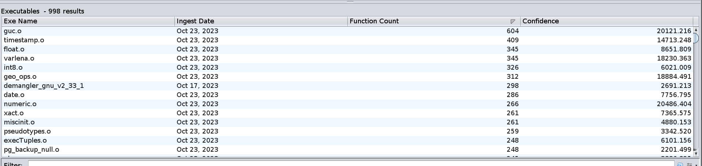

# From Matching Functions to Matching Executables

In this section, we discuss the Executable Results table.
Each row of this table corresponds to one executable in the database.
The information in one row is an aggregation of all of the function-level matches into that row's executable.
Your Executable Results table from the previous query should look similar to the following:

If you select a single row in the table and right-click on it, you will see the following actions:

- **Load Executable** 
  Opens a read-only copy of the program in the Code Browser.
- **Filter on this Executable** 
  Applies a filter which restricts the matches shown in the Function Matches table to matches which occur in the given executable.

## Exercise

1. Sort the Executable results by descending **Function Count**. 
   An entry in this column shows the number of queried functions which have at least one match in the row's executable (if ``foo`` has 2 or more matches into a given executable, it still only contributes 1 to the function count).
   What position is ``demangler_gnu_v2_41``?
   

In this table...
 It's in the first position.

1. An entry in the **Confidence** column shows the sum of the confidence scores of all matches into the corresponding executable.
   If ``foo`` has more than one match into a given executable, only the one with the highest (function-level) confidence contributes to the (executable-level) confidence score.
   Sort the Executable results by descending confidence and observe that ``demangler_gnu_v2_41`` is now much further down the list. 
   

What could explain this?
 If there are many function matches but the sum of all the confidences is relatively low, it is likely that many of the matches involve small functions with common BSim signatures.
 
1. In the Executable match table, right click on ``demangler_gnu_v2_41`` and apply the filter action.
Sort the filtered function matches by descending confidence.
Starting at the top, examine some of the matches and convince yourself that the given explanation is correct.
    - **Note**: You can remove the filter using the **Filter Results** icon  in the toolbar.
     We'll discuss this further in [BSim Filters](BSimTutorial_Filters.md)

From this exercise, we see that unrelated functions can be duplicates of each other, either because they are small or because they perform a common generic action.
Keep in mind that such functions can "pollute" the results of a blanket query.
In the next section, we demonstrate a technique to restrict queries to functions which are more likely to have meaningful matches.

Next Section: [Overview Queries](BSimTutorial_Overview_Queries.md)
