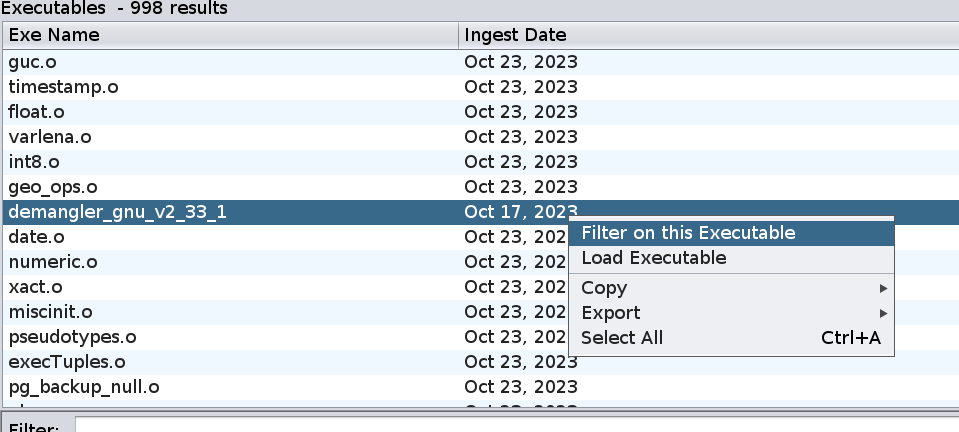

# From Matching Functions to Matching Executables

In this section, we discuss the Executable results table.

Using the results window from the previous query, sort the Executable results table
by "Function Count" (i.e., the number of results which are in a given executable).  You should see the following:

If you select a single row in the table and right-click on it, you will see the following actions:

- **Load Executable** will open a read-only copy of the program in the Code Browser.
- **Filter on this Executable** applies a filter which restricts the matches shown in the Function Matches table to matches which occur in the given executable.

## Exercise

1. If you haven't already, sort the Executable results by descending Function Count. 
What position is `demangler_gnu_v2_33_1`?
    - 

A:
 7 

1. The Confidence column shows the sum of the confidence scores of all matches into each executable.  Sort the Executable results by descending confidence and observe that `demangler_gnu_v2_33_1` is now much further down the list. 
    - 

What could explain this?

     If there are many function matches but the sum of all the confidences is relatively low,
     it is likely that many of the matches involve small functions.  For such a match, it is 
     more likely that the functions agree by chance rather than being derived from the same 
     source code.
     
 
1. In the Executable match table, right click on `demangler_gnu_v2_33_1` and apply the filter
action.  Sort the filtered function matches by descending confidence.  Starting at the top,
perform some code comparisons and convince yourself that the given explanation is correct.
    - Note: You can remove the filter using the "Settings" icon in the upper right.  We'll discuss this further in [BSim Filters](./BSimTutorial_Filters.md)

In the next section, describe a technique to restrict queries to functions which are likely to
have "interesting" matches.

Next Section: [Overview Queries](BSimTutorial_Overview.md)