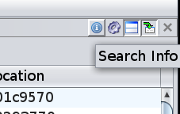
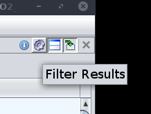

# BSim Filters

There are a number of filters that can be applied to BSim queries, involving names, architectures,
compilers, ingest dates, and many other attributes.

Filter be can applied *server-side* or *client-side*.  Server-side filters affect the results sent
to Ghidra from a BSim server.  Client-side filters apply to the BSim Search results table and can 
be added and removed at will.  However, to "undo" a server-side filter, you have to issue an
additional BSim query without the filter.

Note that overview queries cannot be filtered.

Server-side filters can be applied using the `Filters` drop-down in the BSim Search dialog.

## Exercise: Filters

1. Select all functions in `postgres` and bring up the BSim Search dialog.
1. Use the default query bounds.
1. Apply an `Executable name does not equal` filter with `demangler_gnu_v2_33_1` as the name to
exclude.
1. Perform the query and verify that `demangler_gnu_v2_33_1` is not in the list of executables 
with matches.

  

1. Using the `Search Info` icon, you can see what server-side filters were applied to the query.  
Verify that this information is correct.

  

1. Using the `Filter Results` icon, you can apply client-side filters to the query results.  
Experiment with applying and removing some client-side filters.

Next Section: [Scripting and Visualization](BSimTutorial_Scripting.md)

