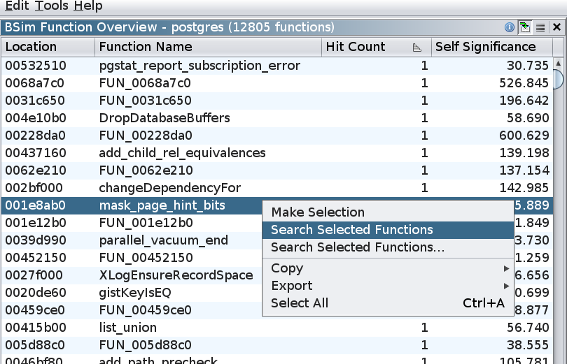

# Overview Queries

An **Overview Query** queries a BSim database for the number of matches to each function in an executable.
The matching functions themselves are not returned. 
Similarity and Confidence thresholds can be set for an Overview Query, but there is no "Matches per Function" bound and no filters can be applied.

To perform an Overview Query, select **BSim -> Perform Overview...** from the Code Browser.

## Exercise: Hit Counts and Self-Significance

1. Perform an Overview query on ``postgres`` using the default query thresholds.
You should see the following result:

1. Sort the table by the "Hit Count" column in ascending order.  Typically, the functions with the largest hit counts will have low self-significance.
Verify that that is the case for this table. 
1. Q: Examine the functions with the highest hit count. Why are there so many matches for these functions?
   

Answer:
 These are all instances of PostgreSQL statistics-reporting functions.  Their bodies are quite similar and they have identical BSim signatures.

## Exercise: Selections and Queries

Using the hit count column, it is possible to exclude functions with large numbers of matches.

1. In the Overview Table, select all functions whose hit count is 2 or less.
1. Right-click on the selection and perform the **Search Selected Functions** action.
   Sort the query results by descending **Function Count** and verify that ``demangler_gnu_v2_41`` is far down the list.

## Exercise: Vector Hashes

Suppose ``foo`` and ``bar`` have the same number of hits in the Overview table.
There are two possibilities:
1. ``foo`` and ``bar`` have distinct feature vectors which happen to have the same number of matches.
1. ``foo`` and ``bar`` have the same feature vector.

An optional column, **Vector Hash**, can be used to distinguish between these two cases.

1. Enable the **Vector Hash** Column in the Overview Table.
1. Find two functions with the same vector hash.
1. Select the two corresponding rows in the table and then transfer the selection to the Listing using the  icon in the BSim Overview toolbar.
1. In the Listing, press ``Shift-C`` or right-click and perform the **Compare Selected Functions** action.
1. In the resulting Function Comparison window, convince yourself that these two functions should have the same BSim signature.

Next Section: [Queries and Filters](BSimTutorial_Filters.md)
