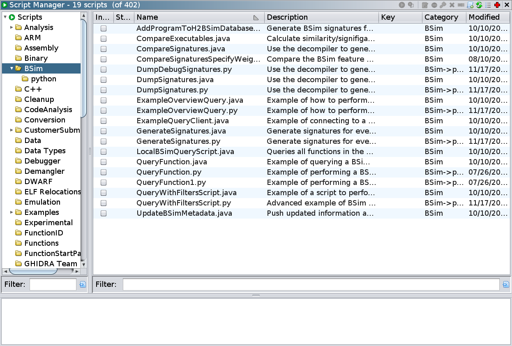
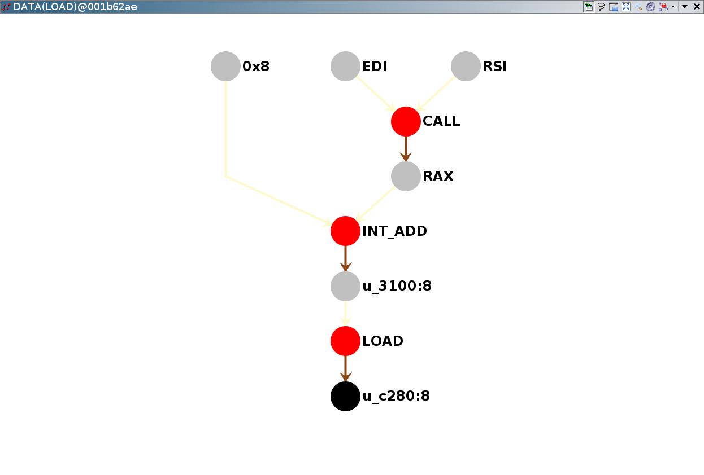

# Scripting and Visualization

Finally, we briefly mention a few other topics related to BSim.

## Scripting BSim

There are are number of example scripts in the ``BSim`` script category, which demonstrate how to interact with BSim programmatically.

## Visualizing Features

Finally, if you'd like to see the particular BSim features in a function, you can use the BSim Feature Visualizer.
This plugin allows you to highlight regions of the decompiled code corresponding to a particular feature and to display a graph representing the feature.

To use this plugin, first enable the ``BSimFeatureVisualizerPlugin`` via **File -> Configure** from the Code Browser.
You can then bring it up via **BSim -> BSim Feature Visualizer**.

This is the end of the tutorial.

[Return to the Beginning](README.md)
