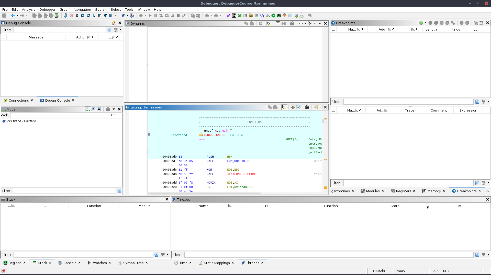

# Getting Started

This course assumes you are already familiar with the basics of using Ghidra, including its static analysis features.
To some degree, static analysis is an integral part of debugging with Ghidra.

## The specimen

Throughout this course, we will examine the provided "Terminal Minesweeper" specimen, named `termmines`.
If the compiled artifact has not been provided for you, you may build it from source using the provided [Makefile](../ExerciseFiles/Debugger/Makefile), but you will need `ncurses.h` first:

```bash
cd GhidraClass/ExerciseFiles/Debugger
make
```

The specimen is designed for Linux, but should be trivially portable to other Unix systems.
You will need `ncurses` and its development headers and libraries available on your system.
Though source code for the specimen is available, we strongly encourage you to work on the course exercises without referring to it.
Symbols and debug information are removed from the binary.
With some effort, `termmines` may even port to Windows; however, we have not tested this course on Windows.

It is a good idea to get acquainted with the specimen.
In general, you should take precautions before running code you do not understand or trust.
For `termmines`, the risk is negligible.
Run it:

```bash
./termmines
```

You should see a 9x9 grid and a cursor you can move with the arrow keys.
Hit **Ctrl-C** to exit.
Probe it for help.
Most Linux programs accept a `-h` argument for help:

```bash
./termmines -h
```

You should now have all the information you need to understand how the game works.
If you have never played Minesweeper before, read up online, and perhaps try playing a couple of games.
Don't get distracted, though.

## Launching on Linux

On Linux, we will use GDB to debug the specimen.
There are many ways to do this, but for the sake of simplicity, import and launch as follows:

1. Import `termmines` into a new Ghidra project.
1. If you have a CodeBrowser open, close it and return to the main Ghidra project window.
1. Drag `termmines` onto the Debugger  in the Tool Chest.
1. This will bring up the specimen in the Debugger tool.
   (If you are prompted to analyze, choose Yes.)

   

1. In the Debugger tool, click the dropdown &blacktriangledown; for the debug  icon in the global tool bar, and select "Debug termmines in GDB locally IN-VM."
1. Wait a bit then verify the Dynamic Listing window (top) is displaying disassembly code.

   

## Launching on Windows

On Windows, we will use dbgeng to debug the specimen.
This is the engine that backs WinDbg.
You may choose an alternative Minesweeper, since terminal applications are less representative of Windows executables.
Follow the same process as for Linux, except import `termmines.exe` and select "Debug termmines.exe in dbgeng locally IN-VM."

## Launching on macOS

Unfortunately, things are not so simple on macOS.
See the instructions for [Building LLDB-Java Bindings](../../../Ghidra/Debug/Debugger-swig-lldb/InstructionsForBuildingLLDBInterface.txt).
Once built, follow the same process as for Linux, except select "Debug termmines in LLDB locally IN-VM."

## Troubleshooting

### I'm having trouble importing `termmines`

Check that `termmines` exists.
You may need to build it yourself using `make`.
If it exists and you are still having trouble, please refer to the Beginner course.

### There is no Debugger icon in my Tool Chest

Double-check that you are looking at the main Ghidra Project window, not a CodeBrowser.
The tool chest is the box of big icons above the list of imported programs.
If it is not there, you can try importing it from the default tools:

1. In the menus, select **Tools &rarr; Import Default Tools**
1. Select "defaultTools/Debugger.tool"
1. Click Import

### There is no Debug / Launch icon in the global toolbar

Double-check that you are in the Debugger tool, not the CodeBrowser tool.
If it is still not there, then you may need to re-import the default Debugger tool as under the previous heading.
If it is still not there, your installation may be corrupt.

### There is no "Debug termmines in GDB locally IN-VM" option in the launch drop-down

You may need to install GDB and/or configure Ghidra with its location.
If you have a copy or custom build of GDB in a non-system path, note its full path.
If you intend to use the system's copy of GDB, then in a terminal:

```bash
which gdb
```

Note the path given.
(If you get an error, then you need to install GDB.)
In a terminal, type the full path of GDB to ensure it executes properly.
Type `q` to quit GDB.

1. From the Debugger Targets window, click the Connect  button.
1. In the Connect dialog, select "gdb" from the dropdown at the top.
1. Enter the full path, e.g., `/usr/bin/gdb`, in the "GDB launch command" field.
1. Click "Connect"
1. If you get an Interpreter window, then things have gone well.
1. Type `echo test` into it to verify it's responsive, then type `q` to disconnect.
1. Close the Debugger tool, then retry.

### The launch hangs for several seconds and then prompt for a "recorder"

You probably have a stale GDB connection, so when you launched you now have multiple connections.
For the prompt, select the option with the highest score.
Examine the Targets window to confirm you have multiple GDB connections.
If you know which is the stale connection, you can right-click it and choose **Disconnect**.
Otherwise, use **Disconnect All** from the drop-down menu and re-launch.

### The Dynamic Listing is empty

Check for an actual connection.
You should see an entry in the Debugger Targets window, a populated Object window, and there should be an Interpreter window.
If not, then your GDB connector may not be configured properly.
Try the steps under the previous heading.

If you have an Interpreter window, there are several possibilities:

#### Ghidra or GDB failed to launch the target:

Check that the original `termmines` exists and is executable.
It must be at the path from where it was originally imported.
If you imported from a share, consider copying it locally, setting its permissions, then re-importing.

#### The target was launched, but immediately terminated:

Check that the specimen has a `main` symbol.
NOTE: It is not sufficient to place a `main` label in Ghidra.
The original file must have a `main` symbol.

Alternatively, in the menus try **Debugger &rarr; Debug termmines &rarr; in GDB locally IN-VM**, and select "Use starti."
This will break at the system entry point.
If you have labeled `main` in Ghidra, then you can place a breakpoint there and continue &mdash; these features are covered later in the course.

Alternatively, try debugging the target in GDB from a separate terminal completely outside of Ghidra to see if things work as expected.

#### The target was launched, but has not stopped, yet

Try pressing the Interrupt  button.
If that doesn't work or is unsatisfactory, try the remedies under the previous heading &mdash; for an immediately terminating target.

#### You hit an uncommon bug where the memory map is not applied properly

This is the case if the Dynamic Listing is completely blank but the Regions window is replete.
The Dynamic Listing just needs to be kicked a little.
The easiest way is to step once, using the  Step Into button in the main toolbar.
If this is not desirable, then you can toggle **Force Full View** back and forth.
In the Regions window, use the drop-down menu to toggle it on, then toggle it off.
The Dynamic Listing should now be populated.
To go to the program counter, double-click the "pc = ..." label in the top right.

#### Something else has gone wrong

Try typing `info inferiors` and similar GDB diagnostic commands into the Interpreter.

### The listings are in sync, but the Dynamic Listing is grey 00s

Check the Auto-Read drop-down near the top right of the Dynamic Listing.
It should be set to **Read Visible Memory, RO Once**.

## Exercise: Launch `termmines`

If you were following along with an instructor, delete your import of `termmines` and/or start a new Ghidra Project.
Starting from the beginning, import `termmines` and launch it in the Ghidra Debugger with GDB.
When your tool looks like the screenshot with a populated Dynamic Listing, you have completed the exercise.
Disconnect before proceeding to the next exercise.

## Customized Launching

For this specimen, you may occasionally need to provide custom command-line parameters.
By default, Ghidra attempts to launch the target without any parameters.
In the menus, use **Debugger &rarr; Debug termmmines &rarr; in GDB locally IN-VM** to launch with customizations.
Ghidra will remember these customizations the next time you launch using the drop-down button from the toolbar.
The first dialog allows you to customize the connection to the back-end debugger.
Unless you have a special copy of GDB, you should probably just click Connect.
The second dialog allows you to customize how the back-end debugger launches the target.
This is where you tweak the command line.
You can also change the actual image, in case it has moved or you want to experiment with a patched version.

## Exercise: Launch with Command-line Help

Launch the specimen so that it prints its usage.
When successful, you will see the usage info in the Debugger's Interpreter window.
**NOTE**: The process will terminate after printing its usage, and as a result, the rest of the UI will be mostly empty.

## Attaching

Attaching is slightly more advanced, but because the target will need to read from stdin, and Ghidra does not properly attach the Interpreter to stdin, we will need to launch the target in a terminal and attach to it instead.
Note this technique is only possible because the target waits for input.
Depending on the task for future exercises, you may still need to launch from the Debugger instead of attaching.

1. Run `termmines` in a proper terminal with the desired command-line parameters.
1. In the Ghidra Debugger, find the Targets window, and click the  Connect button.
1. Select "gdb" from the drop-down box.
1. This dialog should look familiar from the Customized Launching section.
   Just click the Connect button.
1. In the Objects window (below the Targets window), expand the node labeled "Available."
1. In the filter box, type `termmines`.
1. Right-click on the termmines process and select Attach.
   If this fails, select Available again, and click the  Refresh button.


## Exercise: Attach

Try attaching on your own, if you have not already.
Check your work by typing `bt` into the Interpreter.
If you are in `read` you have completed this exercise.
Disconnect before proceeding to the next module: [A Tour of the UI](A2-UITour.md)

## Troubleshooting

If you get `Operation not permitted` or similar when trying to attach, it is likely your Linux system is configured with Yama's `ptrace_scope=1`.
We have provided a stub utility called `anyptracer`.
The utility permits its own process to be traced by any other process and then executes a shell command.
Using `exec` as that shell command enables you to execute the specimen in the permissive process, and thus you can attach to it as if `ptrace_scope=0`, but without reducing the security of the rest of the system.
For example:

```bash
./anyptracer 'exec ./termmines'
```

Alternatively, if you have root access, you can rectify the issue using the relevant documentation available online.
**Beware!** You should not modify this setting on your daily driver, as this substantially reduces the security of your system.
Any compromised process would be allowed to attach to and steal data, e.g., credentials, from any other process owned by the same user.
