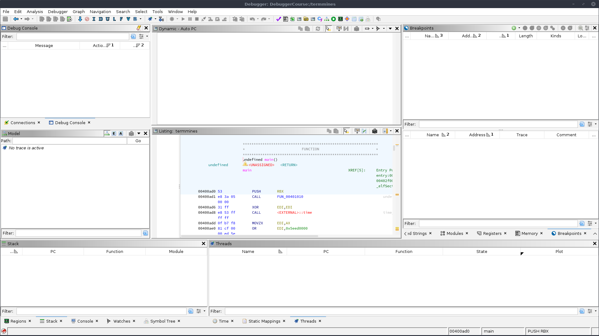
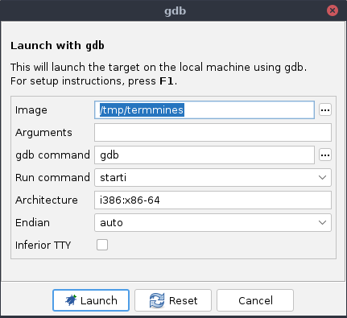
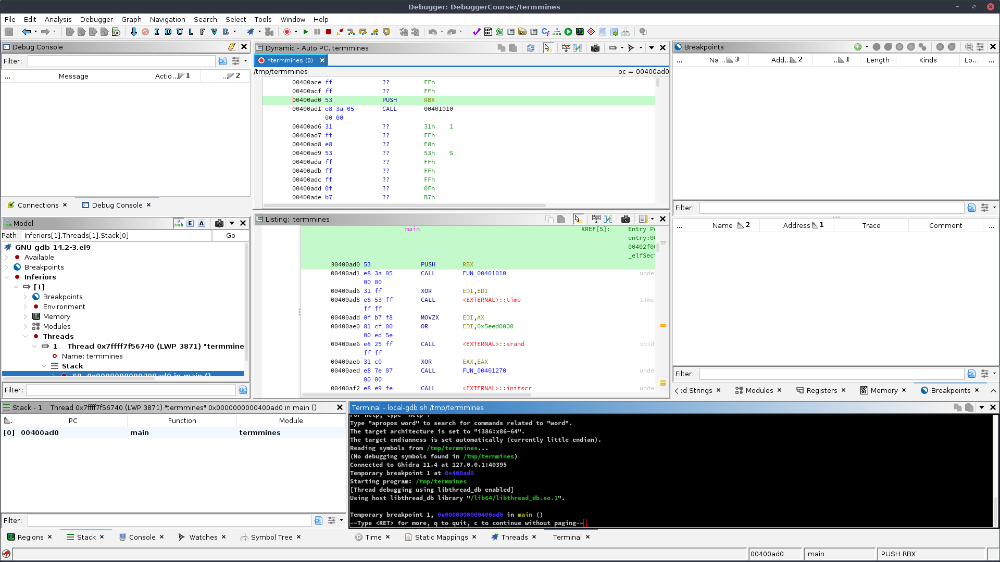

# Getting Started

This course assumes you are already familiar with the basics of using Ghidra, including its static analysis features.
To some degree, static analysis is an integral part of debugging with Ghidra.

## The specimen

Throughout this course, we will examine the provided "Terminal Minesweeper" specimen, named `termmines`.
If the compiled artifact has not been provided for you, you may build it from source using the provided [Makefile](../ExerciseFiles/Debugger/Makefile), but you will need `ncurses.h` first:

```bash
cd GhidraClass/ExerciseFiles/Debugger
make
```

The specimen is designed for Linux, but should be trivially portable to other Unix systems.
You will need `ncurses` and its development headers and libraries available on your system.
Though source code for the specimen is available, we strongly encourage you to work on the course exercises without referring to it.
Symbols and debug information are removed from the binary.
With some effort, `termmines` may even port to Windows; however, we have not tested this course on Windows.

It is a good idea to get acquainted with the specimen.
In general, you should take precautions before running code you do not understand or trust.
For `termmines`, the risk is negligible.
Run it:

```bash
./termmines
```

You should see a 9x9 grid and a cursor you can move with the arrow keys.


Hit **`CTRL`-`C`** to exit.
Probe it for help.
Most Linux programs accept a `-h` argument for help:

```bash
./termmines -h
```

You should now have all the information you need to understand how the game works.
If you have never played Minesweeper before, read up online, and perhaps try playing a couple of games.
Don't get distracted, though.

## Launching on Linux

On Linux, we will use GDB to debug the specimen.
There are many ways to do this, but for the sake of simplicity, import and launch as follows:

1. Import `termmines` into a new Ghidra project.
1. If you have a CodeBrowser open, close it and return to the main Ghidra project window.
1. Drag `termmines` onto the Debugger  in the Tool Chest.
1. This will bring up the specimen in the Debugger tool.
   (If you are prompted to analyze, choose Yes.)

   

1. In the Debugger tool, click the dropdown &blacktriangledown; for the debug  icon in the global tool bar, and select **Configure and Launch termmines using... &rarr; gdb**.

   

1. Change the **Run Command** to "start" (not "starti").
   **NOTE**: In practice, this is rarely recommended, because most targets do not export their `main` function.
1. Click the **Launch** button in the dialog.
1. Wait a bit then verify the Dynamic Listing window (top) is displaying disassembly code.

   

## Launching on Windows

On Windows, we will use the Windows Debugger dbgeng.dll to debug the specimen.
This is the engine that backs WinDbg.
You may choose an alternative Minesweeper, since terminal applications are less representative of Windows executables.
Follow the same process as for Linux, except import `termmines.exe` and select **Configure and Launch termmines.exe using... &rarr; dbgeng**.

## Launching on macOS

On macOS, we will use LLDB to debug the specimen.
This is the debugger included with Xcode.
Follow the same process as for Linux, except choose **lldb** in the last menu.

## Troubleshooting

### I'm having trouble importing `termmines`

Check that `termmines` exists.
You may need to build it yourself using `make`.
If it exists and you are still having trouble, please refer to the Beginner course.

### There is no Debugger icon in my Tool Chest

Double-check that you are looking at the main Ghidra Project window, not a CodeBrowser.
The tool chest is the box of big icons above the list of imported programs.
If it is not there, you can try importing it from the default tools:

1. In the menus, select **Tools &rarr; Import Default Tools**
1. Select "defaultTools/Debugger.tool"
1. Click Import

### There is no Debug / Launch icon in the global toolbar

Double-check that you are in the Debugger tool, not the CodeBrowser tool.
If it is still not there, then you may need to re-import the default Debugger tool as under the previous heading.
If it is still not there, your installation may be corrupt.

### There is no **gdb** option in the launch drop-down

You may have an older Debugger tool still configured for Recorder-based targets.
We are transitioning to TraceRmi-based targets.
Delete your Debugger tool and re-import the default one using the instructions above.
If it is still not there, it's possible your installation is corrupt.
Search for a file called `local-gdb.sh` in your installation.
Unlike the previous system, Trace RMI will not probe your system for dependencies nor hide incompatible launchers.
All installed launchers should be present in the menus, even though some may not work on your configuration.

### The launch hangs for several seconds and then I get prompted with a wall of text

Read the wall of text.
The first line should tell you the exception that it encountered.
Often this is a timeout.
Press the **Keep** button and then find the Terminal, usually in the bottom right.
If you do not see it there, check the **Window &rarr; Terminals** menu.
Once you have found the Terminal, check its output *starting at the top* for diagnostic messages.
If you have something like `bash: gdb: command not found`, it is because you are missing `gdb`, or you need to tell Ghidra where to find it.

If it is just missing, then install it and try again.
If you need to tell Ghidra where it is, then in the launcher drop-down, select **Configure and Launch termmines using... &rarr; gdb**.
DO NOT select **Re-launch termmines using gdb**, since this will not allow you to correct the configuration.

If it looks like there's an error about importing python packages, e.g., "google protobuf," then you need to install some dependencies.
These are listed in the launcher's description.
For your convenience, the correct versions are distributed with Ghidra.
Search for files ending in `.whl` (or `.tar.gz`) and install the required ones using `python3 -m pip install`.

### The Dynamic Listing is empty

Check for an actual connection.
You should see an entry in the **Connection Manager** window, a populated **Model** window, and there should be a **Terminal** window.
If not, then your GDB connector may not be configured properly.
Try the steps under the previous heading.

If you have a **Terminal** window, there are several possibilities:

#### Ghidra or GDB failed to launch the target:

If this is the case, you should see an error message in the Terminal, e.g.: `termmines: no such file or directory`.
Check that the original `termmines` exists and is executable.
You may also need to adjust the **Image** option when configuring the launch.

#### The target was launched, but immediately terminated:

If this is the case, you should see a message in the Terminal, e.g.: `[Inferior 1 (process 1234) exited normally]`.
Check that the specimen has a `main` symbol.
**NOTE**: It is not sufficient to place a `main` label in Ghidra.
The original file must have a `main` symbol.

Alternatively, in the menus try **Debugger &rarr; Configure and Launch termmines using &rarr; gdb**, and select "starti" for **Run Command**.
This will break at the system entry point.
If you have labeled `main` in Ghidra, then you can place a breakpoint there and continue &mdash; these features are covered later in the course.

Alternatively, try debugging the target in GDB from a separate terminal completely outside of Ghidra to see if things work as expected.

#### The target was launched, but has not stopped, yet

Try pressing the Interrupt  button.
If that doesn't work or is unsatisfactory, try the remedies under the previous heading.

#### You hit an uncommon bug where the memory map is not applied properly

This is the case if the **Dynamic Listing** is completely blank but the **Regions** window is replete.
The **Dynamic Listing** just needs to be kicked a little.
The easiest way is to step once, using the  **Step Into** button in the main toolbar.
If this is not desirable, then you can toggle **Force Full View** back and forth.
In the **Regions** window, use the drop-down menu to toggle it on, then toggle it off.
The **Dynamic Listing** should now be populated.
To go to the program counter, double-click the "pc = ..." label in the top right.

#### Something else has gone wrong

Try typing `info inferiors` and similar GDB diagnostic commands into the **Terminal**.

### The listings are in sync, but the Dynamic Listing is grey 00s

Check the **Auto-Read** drop-down near the top right of the **Dynamic Listing**.
It should be set to **Read Visible Memory, RO Once**.

## Exercise: Launch `termmines`

If you were following along with an instructor, delete your import of `termmines` and/or start a new Ghidra Project.
Starting from the beginning, import `termmines` and launch it in the Ghidra Debugger with GDB.
When your tool looks like the screenshot with a populated **Dynamic Listing**, you have completed the exercise.
Disconnect before proceeding to the next exercise.

## Customized Launching

For this specimen, you may occasionally need to provide custom command-line parameters.
By default, Ghidra attempts to launch the target without any parameters.
In the **Debugger** menu, or the **Launch** button's drop-down menu, use **Configure and Launch termmmines &rarr; gdb** to adjust your configuration.
This is where you can specify the image path and command-line parameters of your target.
Ghidra will remember this configuration the next time you launch using the drop-down button from the toolbar.
Launchers with memorized configurations are presented as **Re-launch termmines using...** options.
Using one of those entries will re-launch with the saved configuration rather than prompting.

## Exercise: Launch with Command-line Help

Launch the specimen so that it prints its usage.
When successful, you will see the usage info in the Debugger's **Terminal** window.
**NOTE**: The process will terminate after printing its usage, and as a result, the rest of the UI will be mostly empty.

## Attaching

Attaching is slightly more advanced, but can be useful if the target is part of a larger system, and it needs to be running *in situ*.
For this section, we will just run `termmines` in a separate terminal and then attach to it from Ghidra.
This used to be required, because the older Recorder-based system did not provide target I/O, but this limitation is overcome by the new **Terminal** window
when using Trace RMI.
Note this technique is only possible because the target waits for input.

1. Run `termmines` in a terminal outside of Ghidra with the desired command-line parameters.
1. In the Ghidra Debugger, use the **Launch** button drop-down and select **Configured and Launch termmines using... &rarr; raw gdb**.
   The "raw" connector will give us a GDB session without a target.
1. Ghidra needs to know the location of gdb and the architecture of the intended target.
   The defaults are correct for 64-bit x86 targets using the system's copy of GDB.
   Probably, you can just click **Launch**.
1. In the **Model** window (to the left), expand the *Available* node.
1. In the filter box, type `termmines`.
1. Right click on the node and select **Attach**, or, if you prefer, note the PID, e.g. 1234, then in the **Terminal** type, e.g., `attach 1234`.

## Exercise: Attach

Try attaching on your own, if you have not already.
Check your work by typing `bt` into the **Terminal**.
If you are in `read` you have completed this exercise.
Quit GDB from the **Terminal** before proceeding to the next module: [A Tour of the UI](A2-UITour.md)

## Troubleshooting

If you get `Operation not permitted` or similar when trying to attach, it is likely your Linux system is configured with Yama's `ptrace_scope=1`.
We have provided a stub utility called `anyptracer`.
The utility permits its own process to be traced by any other process and then executes a shell command.
Using `exec` as that shell command enables you to execute the specimen in the permissive process, and thus you can attach to it as if `ptrace_scope=0`, but without reducing the security of the rest of the system.
For example:

```bash
./anyptracer 'exec ./termmines'
```

Alternatively, if you have root access, you can rectify the issue using the relevant documentation available online.
**Beware!** You should not set `ptrace_scope=0` globally, except on a system set aside for debugging, as this substantially reduces the security of that system.
Any compromised process would be allowed to attach to and steal data, e.g., credentials, from any other process owned by the same user.
