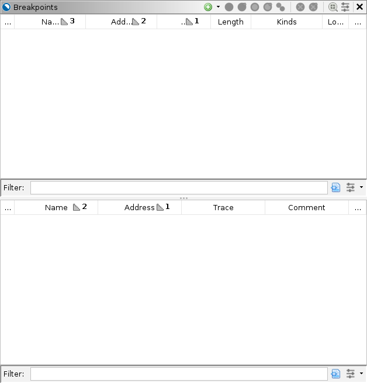
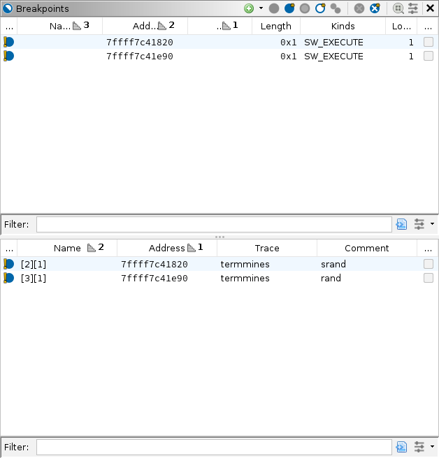

# Using Breakpoints

This module assumes you know how to launch `termmines` in Ghidra using GDB and know where to find the basic Debugger GUI components.
If not, please refer to the previous modules.

This module will address the Breakpoints window in more depth.
While the breakpoint manager is able to deal with a system of targets, we will only deal with a single target at a time.

## Breakpoints

Most likely, this window is empty if you have been following the lesson.



From here, you can toggle and delete existing breakpoints.
There are several ways to set a new breakpoint:

1. From any static or dynamic listing window, including Disassembly, Memory/Hex, and the Decompiler, right-click and select  Set Breakpoint, press **K** on the keyboard, or double-click the margin.
1. From the Objects window click the  Add Breakpoint button or press **F3** on the keyboard.
1. From the Interpreter window, use the GDB command, e.g., `break main`.

The advantage of using the listings is that you can quickly set a breakpoint at any address.
The advantage of using the Objects or Interpreter window is that you can specify something other than an address.
Often, those specifications still resolve to addresses, and Ghidra will display them.
Ghidra will memorize breakpoints by recording them as special bookmarks in the imported program.
There is some iconography to communicate the various states of a breakpoint.
When all is well and normal, you should only see enabled  and disabled  breakpoints.
If the target is terminated (or not launched yet), you may also see ineffective  breakpoints.

## Examining Minesweeper Board Setup

Suppose we want to cheat at `termmines`.
We might like to understand how the mines are placed.
Knowing that the mines are placed randomly, we might hypothesize that it is using the `srand` and `rand` functions from the C standard library.
While we can test that hypothesis by examining the imports statically, we might also like to record some actual values, so we will approach this dynamically.
(This is the Debugger course, after all.)
The breakpoint on `srand` will allow us to capture the random seed.
The breakpoint on `rand` will help us find the algorithm that places the mines.

### Set the Breakpoints

In the Interpreter, type the GDB commands to set breakpoints on `srand` and `rand`:

```gdb
break srand
break rand
```

The breakpoint window should now be updated:



For a single target, the lower panel of the Breakpoints window does not add much information, but it does have some.
We will start with the top panel.
This lists the "logical" breakpoints, preferring static addresses.

* The left-most column **Enabled** indicates the breakpoint's state.
  Here, we see the inconsistent  overlay, because Ghidra cannot save the breakpoint without a module image.
  That is because `srand` and `rand` are in a different module, and we have not yet imported it into Ghidra.
* The next column **Name** is the name of the breakpoint.
  This is for informational purposes only.
  You can rename a breakpoint however you like, and it will have no effect on the target nor back-end debugger.
* The next column **Address** gives the address of the breakpoint.
  Notice that the addresses were resolved, even though the breakpoints were specified by symbol.
  Typically, this is the *static* address of the breakpoint; however, if the module image is not imported, yet, this will be the *dynamic* address, subject to relocation or ASLR.
* The next column **Image** gives the name of the imported image containing the breakpoint.
  Again, because the module has not been imported yet, this column is blank.
* The next column **Length** gives the length of the breakpoint.
  In GDB, this generally applies to watchpoints only.
* The next column **Kinds** gives the kinds of breakpoint.
  Most breakpoints are software execution breakpoints, indicated by "SW_EXECUTE."
  That is, they are implemented by patching the target's memory with a special instruction (`INT3` on x86) that traps execution.
  There are also hardware execution breakpoints indicated by "HW_EXECUTE," and access breakpoints indicated by "HW_READ" and/or "HW_WRITE".
  **NOTE**: GDB would call these "watchpoints."
  An advantage to software breakpoints is that you can have a practically unlimited number of them. Some disadvantages are they can be detected easily, and they are limited to execution breakpoints.
* The next column **Locations** counts the number of locations for the breakpoint.
  For a single-target session, this should always be 1.
* The final column **Sleigh** is only applicable to the emulator.
  It indicates that the breakpoint's behavior has been customized with Sleigh code.
  This is covered in [Emulation](B2-Emulation.md).

Now, we move to the bottom panel.
This lists the breakpoint locations, as reported by the back-end debugger(s).
The Enabled, Address, and Sleigh columns are the same as the top, but for the individual *dynamic* addresses.

* The **Name** column is the name as designated by the back-end.
* The **Trace** column indicates which target contains the location.
  The text here should match one of the tabs from the Threads panel.
* The **Comment** column is a user-defined comment.
  Its default value is the specification that generated it, e.g., `srand`.
* The **Threads** column indicates if the breakpoint is scoped to a limited set of threads.
  Its use is atypical.

### Toggling the Breakpoints

While there is no need to toggle the breakpoints right now, it is a good time to demonstrate the feature.
There are several ways to toggle a breakpoint:

1. In any listing, as in setting a breakpoint, right-click and select a toggle action, press **K** on the keyboard, or double-click its icon in the margin.
1. From the Objects window, expand the Breakpoints node, right-click a breakpoint and select Toggle or press **T** on the keyboard.
1. From the Breakpoints window, single-click the breakpoint's status icon, right-click an entry and select a toggle action, or create a selection and use a toggling action from the local toolbar.
   Either panel works, but the top panel is preferred to keep the breakpoints consistent.
   The local toolbar also has actions for toggling all breakpoints in the session.
1. From the Interpreter window, use the GDB commands, e.g., `disable 2`.

Practice toggling them.
Notice that no matter how you toggle the breakpoints, the display updates.
You might also type `info break` into the Interpreter to confirm the effect of toggling breakpoints in the GUI.
When you are finished, ensure both breakpoints are enabled.

### Importing `libc`

While the Debugger can operate without importing external modules, it generally works better when you have.
The symbols `srand` and `rand` are in `libc`.
If you would like to save the breakpoints we placed on them, you must import the module.
You could do this in the usual manner, but the Debugger offers a convenient way to import missing modules.

1. Navigate to a dynamic address that would be mapped to the missing module.
   For our scenario, the easiest way to do that is to double-click an address in the Breakpoints window.
   Either one points somewhere in `libc`.
1. Check the Debug Console window for a note about the missing module:

   

1. Click the import button &mdash; leftmost of the remedial actions.
   It will display a file browser pointed at the library file.
1. Proceed with the import and initial analysis as you would in the CodeBrowser.

Once imported, the Breakpoints window should update to reflect the static addresses, the breakpoints should become consistent, and the Static Listing should now be synchronized when navigating within `libc`.


### Capturing the Random Seed

We can now allow `termmines` to execute, expecting it to hit the `srand` breakpoint first.
Click  Resume.
If all goes well, the target should break at `srand`.
If you have never written code that uses `srand` before, you should briefly read its manual page.
It takes a single parameter, the desired seed.
That parameter contains the seed this very moment!
We can then examine the value of the seed by hovering over `param_1` in the decompiler.


We will cover other ways to examine memory and registers in the [Machine State](A4-MachineState.md) module.
We have contrived `termmines` so that its random seed will always start with `0x5eed____`.
If you see that in the value displayed, then you have successfully recovered the seed.
This seed will be used in an optional exercise at the end of this module.
You might write it down; however, if you re-launch `termmines` between now and then, you will have a different seed.

### Locating the Mine Placement Algorithm

Press  Resume again.
This time, the target should break at `rand`.
We are not interested in the `rand` function itself, but rather how the placement algorithm is using it.
Press  Step Out to allow the target to return from `rand`.
If you still have the Decompiler up, you should be in a code block resembling:

```c {.numberLines}
while (iVar2 = DAT_00604164, iVar1 = DAT_00604160, iVar10 < _DAT_00604168) {
  iVar3 = rand();
  iVar2 = DAT_00604164;
  iVar11 = rand();
  lVar7 = (long)(iVar11 % iVar2 + 1) * 0x20 + (long)(iVar3 % iVar1 + 1);
  bVar14 = *(byte *)((long)&DAT_00604160 + lVar7 + 0x1c);
  if (-1 < (char)bVar14) {
    iVar10 = iVar10 + 1;
    *(byte *)((long)&DAT_00604160 + lVar7 + 0x1c) = bVar14 | 0x80;
  }
}
```

If you are thinking, "I could have just found `rand` in the symbol table and followed its XRefs," you are correct.
However, it is useful to use a dynamic debugging session to drive your analysis chronologically through execution of the target, even if much of that analysis is still static.
The advantages of a dynamic session along side static analysis should become more apparent as you progress through this course.

### Exercise: Diagram the Mines

You goal is to capture the location of all the mines.
So that you can check your work later, you should run `termmines` in a terminal and attach to it from Ghidra.
You will probably want to disable the breakpoints on `rand` and `srand` for now.
Devise a strategy using breakpoints and the control buttons (Step, Resume, etc.) so that you can observe the location of each mine.
Use pen and paper to draw a diagram of the board, and mark the location of each mine as you observe the algorithm placing it.
There should only be 10 mines in Beginner mode.
Once the mines are placed, press  Resume.
Check you work by winning the game.
Alternatively, you can intentionally lose to have the game reveal the mines.

### Optional Exercise: Replicate the Boards (Forward Engineering)

You will need a C development environment for this exercise.
Because, as we have now confirmed, `termmines` is importing its random number generator from the system, we can write a program that uses that same generator.
Further, because we can capture the seed, and we know the placement algorithm, we can perfectly replicate the sequence of game boards for any `termmines` session.

Write a program that takes a seed from the user and prints a diagram of the first game board with the mines indicated.
Optionally, have it print each subsequent game board when the user presses ENTER.
Check your work by re-launching `termmines` (see note about attaching below), capturing its seed, inputting it into your program, and then winning the game.
Optionally, win 2 more games in the same session.

**NOTE**: We will need a more advanced attaching technique to check your work, because you will need both to break on `srand` (which happens early in the process' execution, ruling out our usual attach technique) and to interact with it in the terminal (which rules out launching in Ghidra).
There are a few ways around this, including using `gdbserver` or using `set inferior-tty`.
If you are already familiar with those, you can try one.
The technique we recommend here is using a stub that will suspend itself and then execute `termmines`.
We can then run the stub in a terminal outside of Ghidra, attach to that stub, and then allow it to proceed into `termmines`.
In this way, we can attach to the process in the terminal before it reaches `srand`.
The stub is fairly easy to write in Bash and should be similar in other shells.

1. In a terminal running Bash (see note if you're using `anyptracer`):
   ```bash
   (echo $BASHPID; kill -SIGSTOP $BASHPID; exec ./termmines)
   ```
   The parentheses will start `bash` in a new subprocess.
   The first two commands cause it to print its own process ID and then suspend itself.
   Your terminal should display the PID and report the stopped process.
   
   **NOTE**: If you need to use the `anyptracer` stub, then the invocation is more complicated:
   ```bash
   ./anyptracer 'exec bash -c "echo $BASHPID; kill -SIGSTOP $BASHPID; exec ./termmines"'
   ```
   In principle, it works the same except wrapped in the `anyptracer` stub.
   The parentheses are no longer needed, nor allowed, since `anyptracer` is already a subprocess of your shell.
   If you include parentheses, you will get a second sub-subprocess to which you cannot attach.
1. In Ghidra, follow the usual steps to attach, but use the PID printed in your terminal.
   **NOTE**: The process is still technically running `bash` when you attach to it.
1. In the Interpreter panel:
   ```gdb
   break main
   ```
   **NOTE**: At this point `main` technically refers to the symbol in `bash`, but GDB will adjust its location once the target loads `termmines`.
1. Back in your terminal running Bash:
   ```bash
   fg
   ```
   This will cause Bash to return the stub to the foreground of the terminal.
   Without this step, the system will repeatedly suspend the process whenever it attempts any I/O on that terminal.
1. In Ghidra, press Resume (or use `continue` in the Interpreter) until you hit the breakpoint at `main`.
   This permits the stub to complete its third command `exec ./termmines`.
   The `exec` command is different than normal command execution.
   Instead of creating a subprocess, it *replaces* the image of the stub process, so the process is now running `termmines`.
1. Refresh the Modules node in the Objects window.
   You may need to clear your filter text.
   Expand the Modules node and verify it lists `termmines` instead of `bash`.
   Without this step, your listings may go out of sync.

At this point, you are attached to your target running in the terminal, and you have trapped it at `main`.
Because you were attached to it when it was still `bash`, you will likely see a lot of extraneous history.
For example, the Modules panel will report many of the modules that had been loaded by `bash`.
Please note their lifespans, however.
They should correctly indicate those modules are no longer loaded.
In any case, you now have the tools needed to check your work for this exercise.
