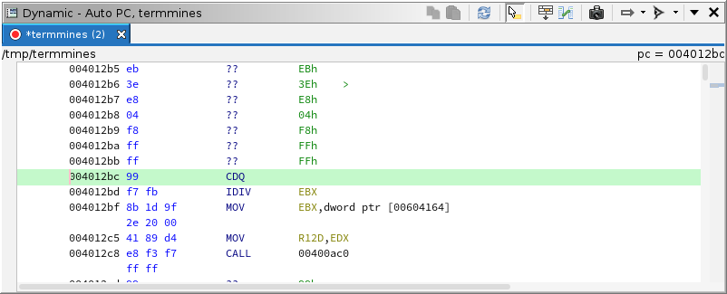

# Examining Machine State: Memory, Registers, and Variables

This module assumes you know how to launch `termmines` in Ghidra using GDB, and know where to find the basic Debugger GUI components.
It also assumes you know the basic control commands, e.g., Resume, Step, and Interrupt; as well as some basics for breakpoints.
If not, please refer to the previous modules.

This module will address the following features in more depth:

* Dynamic Listing window
* Dynamic Bytes window
* Registers window
* Watches window
* Sleigh expressions
* Variable value hovers

## Machine State

There are at least two ways to define machine state.
One way based on a high-level understanding of a program is the collective values of all variables.
Another based on a low-level understanding of a program is the collective values of all memory and all registers of all threads.
Because Ghidra is primarily concerned with examining software at the low level, albeit to obtain a high-level understanding, we will generally stick with the low-level definition.
One could argue that machine state also includes the underlying system and hardware, including peripherals.
When debugging user-space applications, Ghidra cannot generally inspect the underlying system, except for a few things granted by the back-end debugger, e.g., the virtual memory map.
Thus, as far as we are concerned, the machine state does not include the underlying system, but it is still something you must be aware of while debugging.

Note that we also treat *registers* as something separate from *memory*.
While technically, one could argue registers are the closest and smallest memory to the CPU, we think of memory as an addressable array, e.g., DIMMs and flash ROMs.
If applicable, *memory-mapped* registers are considered part of memory by Ghidra.

The Ghidra Debugger provides mechanisms for viewing and modifying machine state at both the low and high levels.
The Dynamic Listing and Memory viewer provide access to memory, the Registers window provides access to registers, and the Watches window provides access to memory and registers via expressions.
The only means of accessing high-level variables is through value hovers, which are available in all listings and the Decompiler.

### Patching

Many of the features allow you to edit the values, i.e., *patch* the live target.
The windows that are adaptations of their static counterparts work more or less as expected.
Edits in any *dynamic* window will attempt to patch the live target.
Edits in any *static* window will **not** patch the live target; they modify the program database as usual.
Some dynamic windows may present tables with editable cells.
These will often include a *write-lock* toggle, like the static Byte viewer, to avoid accidental patching.
Furthermore, you must use the  Control Mode toggle in the global toolbar (next to the control actions) to enable patching throughout the Debugger tool.
For now, please only use the "Control Target" and "Control Target w/ Edits Disabled" options.
The write toggle is included here so that actions like copy-paste do not lead to accidental patching.

## The Dynamic Listing

Up to this point, we have only used the Dynamic Listing to display the instructions at the program counter.
It can actually view and mark up any part of the machine state in memory, e.g., mapped images, heap pages, stack pages.
Where the memory is mapped to images, Ghidra attempts to synchronize the Static Listing and, by extension, the other static analysis windows.
The Dynamic Listing has most of the same features as the Static Listing.

Re-launch `termmines` and then navigate to `rand`.
You may notice that the Static Listing has disassembly, but the Dynamic Listing does not.
This is because Ghidra has not observed the program counter at `rand` yet, so it has not automatically disassembled it.
To manually disassemble in the Dynamic Listing, place your cursor where you expect an instruction and press **D**, just like you would in the Static Listing.

This action differs in that it does not follow flow.
It proceeds linearly, stopping at any control transfer instruction.

Now, we will examine the stack segment.
Click the  Track Location drop-down and select **Track Stack Pointer**.
The window should seek to (and highlight in pale green) the address in the stack pointer.
Since the target has just entered `main`, we should expect a return address at the top of the stack.
With your cursor at the stack pointer, press **P** to place a pointer there, just like
you would in the Static Listing.
You can now navigate to that address by double-clicking it.
To return to the stack pointer, you can use the back arrow in the global toolbar, you can click the  Track Location button, or you can double-click the `sp = [Address]` label in the top right of the Dynamic Listing.

To examine a more complicated stack segment, we will break at `rand`.
Ensure your breakpoint at `rand` is enabled and press  Resume.
Your Dynamic Listing should follow the stack pointer.
In the menus, select **Debugger &rarr; Analysis &rarr; Unwind from frame 0** or press **U**.

**NOTE**: We will cover the Stack window later in the course, which is probably a more suitable way to navigate stack frames.
It is populated by the back-end debugger, which can usually unwind the stack more reliably than Ghidra.
The Unwind Stack action is useful when you want an in-depth understanding of the actual contents of the stack, or when you are emulating.

Now, switch back to **Track Program Counter**.
If you would like to track both the Program Counter and the Stack Pointer, click the  Clone button in the local toolbar.
Like the Static Listing, this clones an instance of the Dynamic Listing, which you can configure differently than the primary Dynamic Listing.
Only the primary Dynamic Listing will synchronize, and it does so only with the primary Static Listing.
**NOTE**: For the sake of disambiguation, we will use the term *clone*, not *snapshot* when referring to multiple instances of a Ghidra window.
While this is inconsistent with the Ghidra Beginner course materials, it is necessary to avoid confusion with snapshots of the machine state, discussed later in this module.

The dynamic listing offers several additional features:

### Cache Status Indication

The listing's contents are read from a live target, which may become unresponsive or otherwise temperamental.
The Debugger uses a database, which acts as a cache separating the GUI from the live target.
The UI requests memory pages from the target, the target asynchronously retrieves those pages and stores them into the database, then the database updates the UI.
This sequence does not always go as expected; thus, pages with stale data are displayed with a grey background.
This may also happen if auto-read is disabled.
Typically, user-space targets are not so temperamental, but others may be, or memory reads could be expensive, in which case disabling automatic memory reads may be advantageous.
If the back-end debugger reports an error while reading memory, the first address of the page will have a red background.
To refresh the visible or selected page(s), click the  Refresh button.
Examine the Debug Console window for errors / warnings before spamming this button.
To toggle auto read, use the  Auto-Read drop-down button from the local toolbar.

### Address Tracking

We have already demonstrated this, but there are some finer details.
Some of the tracking options depend on the Watches window, discussed later in this module.
On occasion, the location cannot be displayed in the listing, typically because it falls outside of the memory map.
If this happens, the address label at the top right of the listing will have red text.

### Module / Region Indicator

In the top left a label will display the name of the section containing the cursor.
If there is no containing section, it will fall back to the containing module and then to the containing region.
Rarely, this label will be empty.
This can happen when the cursor is outside any known region, which only happens if you configure Ghidra to ignore the memory map.

### Go To

The Go To action in the Dynamic Listing differs from the one in the Static Listing.
Like the static one, it accepts an address in hexadecimal, possibly prefixed with the address space and a colon.
However, it also accepts Sleigh expressions, allowing you to treat `RAX` as a pointer and go to that address, for example.
We cover Sleigh expressions later in this module.

### Compare

The Compare action in the Dynamic Listing also differs from the one in the Static Listing.
It allows the comparison of two machine state snapshots, covered in the [Navigation](A5-Navigation.md) module.

### Exercise: Reverse Engineer the Board

All of the features in the default CodeBrowser tool are also in the default Debugger tool, providing you Ghidra's full suite of static analysis tools during your dynamic sessions, albeit they are not as immediately accessible.
Your task is to reverse engineer the game board's layout in memory.
Because you are in a dynamic session, you have an example board to work with.
As you navigate the `.data` section of `termmines` in the Static Listing, the Dynamic Listing will follow along showing you the live values in memory.
You can also experiment by placing code units in the Dynamic Listing before committing to them in the Static Listing.

#### Questions:

1. How are the cells allocated?
1. How are the cells indexed? Row major, color major? 0-up, 1-up?
1. What is happening around the "border" of the board? Why might the programmer have chosen this design?

## The Memory Viewer

Just as the Dynamic Listing is the analog of the Static Listing, the Memory viewer is the analog of the Byte viewer.
It is not visible by default.
To open it, use **Windows &rarr; Byte Viewer &rarr; Memory ...** in the menus.
Its default configuration should be Auto PC, the same as the Dynamic Listing's default.
It has all the same additional Debugger features as the Dynamic Listing.
Furthermore, bytes that have changed are displayed in red text.

### Exercise: Display the Board in Hex

This is a bit quick and dirty, but it works and can be useful.
Your task is to configure the Memory viewer so that (within the memory allocated to the board) the rows and columns of the Memory viewer correspond to the rows and columns of the game board.
**TIP**: Use the *Alignment Address* and *Bytes Per Line* settings.

## Registers

The Registers window gives a view of all the registers on the target and their current values.
The register set can be very large, so there are a few ways to sift and sort.
As in most Ghidra tables, you can filter using the box below the registers table.
Additionally, you can use the column headers to sort.
The columns are:

* The **Favorite** column indicates which registers are your favorite.
  By default, this includes the instruction pointer and the stack pointer.
  You can quickly choose your favorite(s) by toggling the check boxes in this column.
  Because this column is sorted by default, your favorites are positioned at the top.
* The **Number** column gives the number assigned to the register by Ghidra's processor specification.
  This is mostly just to make the default sorting deterministic.
* The **Name** column gives Ghidra's name for the register.
  This usually matches the name given by the back-end debugger, but may not.
  For example, on x86-64, what Ghidra calls `rflags` GDB calls `eflags`.
* The **Value** column gives the register's current value in hexadecimal.
  Values in gray are stale.
  Values in red have changed.
  Right-clicking this column will present options to Go To the address, as if the register were a pointer.
* The **Type** column allows you to assign a type to, i.e., create a data unit on, the register.
  This has more utility for float types than integers, but it may still help you record what you know about how a register is being used.
* The **Representation** column displays the register's value according to its assigned type, if applicable.
  If the type is a pointer, then double-clicking this value will go to the address in the Dynamic Listing.

If you would like to adjust the list of registers in the table, use the  Select Registers button in the local toolbar.
This will present all the registers in Ghidra's processor specification, including those which are just artifacts of Sleigh.
Typically, this is not necessary, since the table will include all registers recognized by both Ghidra and the back-end debugger.
Nevertheless, if you believe a register is missing, it is wise to check this selection.

### Exercise: Reduce the Mines

If you have not already reverse engineered the mine placement algorithm, do that now.
Think up a strategy you might employ, by patching a register, to reduce the number of mines placed on the board.
The strategy need not result in a permanent change.
It should only affect the round being set up.
For this exercise, you cannot patch memory, but you may place a breakpoint.
Verify your work by playing the round.

## Watches

The Watches window gives the values of several user-specified Sleigh expressions.
This can provide an alternative to the Registers window when you are really only interested in a couple of registers.
It can also watch values in memory.
Furthermore, when a watch has a memory address, the expression will appear as an option in the Location Tracking menus of the Listing and Memory viewers.
Selecting that option will cause the window to follow that watch as its address changes.

To add a watch, click the  Add button.
A new entry will appear.
Double-click the left-most cell of the row to set or edit the Sleigh expression.
For starters, try something like `RDI`.
(Conventionally, this is the location for the first parameter on Linux x86-64 systems.)
The context menus for the Listing and Registers windows include a "Watch" action, which adds the current selection to the Watches window.

The columns are:

* The **Expression** column is the user-defined Sleigh expression.
* The **Address** column is the address of the resulting value, if applicable.
  This may be in `register` space.
  Double-clicking this cell will go to the address in the Dynamic Listing.
* The **Symbol** column gives the symbol in a mapped static image closest to or containing the address, if applicable.
* The **Value** column gives the "raw" value of the expression.
  If the result is in memory, it displays a byte array; otherwise, it displays an integer.
* The **Type** and **Representation** columns work the same as in the Registers window, except they do *not* save the data unit to the database.
  This has more uses than the Registers window.
  For example, try `*:30 RDI` and set this to `TerminatedCString`.
  Whenever `RDI` is a string pointer, this will display the string up to 30 characters.
* The **Error** column reports any errors in compiling or evaluating the expression.

## Sleigh Expressions

Watches and Go-To commands are expressed using Ghidra's Sleigh language.
More precisely, expressions are the sub-language of Sleigh for the right-hand side of assignment statements in semantic sections.
If you already know this language, then there is little more to learn.
Of note, you may use labels from mapped program images in your expression.
For example, to see how far a return address is into `main`, you could use `*:8 RSP - main`.

For the complete specification, see the Semantic Section in the [Sleigh documentation](../../../Ghidra/Features/Decompiler/src/main/doc/sleigh.xml).

Sleigh is a bit unconventional in that its operators are typed rather than its variables.
All variables are fix-length bit vectors.
Their sizes are specified in bytes, but they have no other type information.

### Variables and Constants

Here are some examples of things you can reference by name:

* **Register**: `RAX`
* **Label**: `main`
* **Constant**: `1234:8` or `0x42d:8` &mdash; the value 1234 encoded as an 8-byte integer

Registers vary by processor, but any register known to Ghidra's specification is allowed.
(Due to limitations in Sleigh, you cannot refer to the `contextreg` or any of its sub-registers.)
A label may come from any Ghidra program database that is mapped to the current target.
Due to limitations in Sleigh, you cannot specify a label's namespace.
The compiler will search only by name and select arbitrarily from multiple matches.

### Operators

Here we will demonstrate each operator by example:

* **Integer Addition**: `RAX + RCX`
* **Integer Subtraction**: `RAX - RCX`
* **Integer Negation**: `-RAX`
* **Integer Multiplication**: `RAX * RCX`
* **Unsigned Integer Division**: `RAX / RCX`
* **Unsigned Integer Remainder**: `RAX % RCX`
* **Signed Integer Division**: `RAX s/ RCX`
* **Signed Integer Remainder**: `RAX s% RCX`
* **Left Shift**: `RAX << RCX`
* **Unsigned Right Shift**: `RAX >> RCX`
* **Signed Right Shift** `RAX s>> RCX`
* **Integer Comparison**: `RAX == RCX` or `RAX != RCX`
* **Unsigned Integer Comparison**: `RAX < RCX` or `RAX > RCX` or `RAX <= RCX` or `RAX >= RCX`
* **Signed Integer Comparison**: `RAX s< RCX` etc.
* **Float Addition**: `MM0 f+ MM1`
* **Float Subtraction**: `MM0 f- MM1`
* **Float Negation**: `f-MM0`
* **Float Multiplication**: `MM0 f* MM1`
* **Float Division**: `MM0 f/ MM1`
* **Float Absolute Value**: `abs(MM0)`
* **Float Square Root**: `sqrt(MM0)`
* **Float Comparison**: `RAX f== RCX` or `RAX f< RCX` etc.
* **Bitwise And**: `RAX & RCX`
* **Bitwise Or**: `RAX | RCX`
* **Bitwise Xor**: `RAX ^ RCX`
* **Bitwise Not**: `~RAX`
* **Boolean And**: `RAX && RCX`
* **Boolean Or**: `RAX || RCX`
* **Boolean Xor**: `RAX ^^ RCX`
* **Boolean Not**: `!RAX`

**NOTE**: If the result of your expression is in floating point, you will need to set the type of the watch accordingly.
The "raw" display will render the bit vector as an integer or byte array.
To read memory:

* **Dereference**: `*:8 RSP` or `*[ram]:8 RSP`

**NOTE** The `[ram]` part is optional.
On x86, you will rarely if ever specify the space, since there is only one physical RAM space.
The `:8` part specifies the number of bytes to read from memory.
It is also optional, but only if the size can be inferred from the rest of the expression.
To manipulate variable size:

* **Zero Extension**: `RAX + zext(EBX)`
* **Sign Extension**: `RAX + sext(EBX)`
* **Truncation**: `RAX:4` &mdash; Equivalent to `EAX`
* **Truncation**: `AL + RBX(4)` &mdash; AL added to the the 5th byte of RBX
* **Bit Extraction**: `RAX[7,8]` &mdash; Equivalent to `AL`

**NOTE**: The second form of truncation drops the least-significant 4 bytes of RBX and takes as many of the remaining bytes (1 in this case) as necessary to match size with AL.

**NOTE**: Need for these next miscellaneous operators in Watch expressions is rare:

* **Unsigned Carry**: `carry(RAX,RBX)`
* **Signed Carry**: `scarry(RAX,RBX)`
* **Signed Borrow**: `sborrow(RAX,RBX)`
* **Float NaN**: `nan(MM0)`
* **Convert Integer to Float**: `MM0 + int2float(RAX)` &mdash; Context required to infer the float size
* **Convert Float to Integer**: `RAX + trunc(MM0)` &mdash; Context required to infer the integer size
* **Convert Float Size**: `MM0 + float2float(MM0_Da)` &mdash; Context required to infer the new float size
* **Float Round Ceiling**: `ceil(MM0)`
* **Float Round Floor**: `floor(MM0)`
* **Float Round Nearest**: `round(MM0)`

### Exercise: Find and Modify the Board Dimensions

Your task is to set up watches on the width and height of the game board, and then use those watches to change the size of the board.
This may involve some trial and error, and it may not work perfectly due to the way `ncurses` refreshes the screen.
For this exercise, patching memory is expected, and the change should last until the target is terminated.

**TIP**: If the `termmines` image is subject to ASLR, and you want your watch expression to generalize over re-launches, try using `main` as an anchor for the image base.

### Exercise: Watch the Cell to be Mined

Your task is to watch the byte value of the cell that is about to have a mine placed in it.
You will probably want to set a breakpoint somewhere in the mine placement algorithm.
It is okay if the watch does not *always* display the correct byte.
However, it must be correct whenever the program counter is at your breakpoint.
Register allocations are fairly volatile, and as a result, watch expressions that refer to registers are only valid in a limited scope.
The rest of the time, even though the watch may evaluate successfully, its value may have no real meaning.
Check your work by observing the mine bit being ORed in as you step the target.

**TIP**: Try creating watches for the row and column indices, first.
Then, perhaps referring to the Decompiler, formulate the expression that dereferences that cell in the board.

## Variable Hovers

You may have already used these if you completed the exercises in the [Breakpoints](A3-Breakpoints.md) module.
If you hover over a variable in any listing or the Decompiler, the Debugger will attempt to evaluate it and display information about it.
In some cases, evaluation may involve unwinding the stack.
Unwinding proceeds until the Debugger finds an invocation of the function containing or defining the variable.
If unwinding fails, the Debugger may disregard the stack.
In dynamic windows, the Debugger generally disregards the stack.
In static windows, the Debugger still uses dynamic information to unwind the stack and evaluate the variable.
A variable may be any of the following:

* A register in the listing.
  In this case, the hover will report the register's value in the function's frame.
* A local or parameter in the listing.
  If the variable is allocated in a register, this behaves the same as hovering that register, except with additional information presented.
  If the variable is allocated in stack space, this only succeeds if unwinding succeeds.
* A global variable in the listing.
  Unwinding is unnecessary for these.
* A local or parameter in the Decompiler.
  This behaves similarly to hovering a variable in the Static Listing.
* A global in the Decompiler.
  This behaves similarly to hovering a global variable in the Static Listing.
* A field reference in the Decompiler.
  A field reference is essentially a C expression in terms of other variables.
  This will evaluate those variables and then evaluate the expression.

Depending on the particular variable and other circumstances, the hover will contain some combination of these rows:

* **Name**: The name of the variable
* **Type**: The type of the variable
* **Location**: The static location of the variable, e.g., `Stack[0x4]`
* **Status**: A progress indicator
* **Frame**: If evaluation required unwinding, a description of the frame used for context
* **Storage**: The dynamic, physical location of the variable, e.g., `7fffffffe618`
* **Bytes**: The raw bytes currently stored in the memory allocated to the variable
* **Integer**: The "raw" integer value of the variable, rendered with varyied signedness and radix
* **Value**: The value of the variable, according to its type
* **Instruction**: If the variable points to code, the target instruction
* **Warnings**: Warnings emitted during evaluation
* **Error**: If the value could not be evaluated, an explanation or the exception

The Name, Type, and Location entries are informational.
They tell you about the variable and its static definition.
The Status, Frame, and Storage entries are also informational, but tell you about the variable's dynamic evaluation.
The Bytes, Integer, Value, and Instruction entries tell you the dynamic value of the variable.
Finally, the Warnings and Error entries provide diagnostics.
If there are many warnings, then the value may not be accurate.
