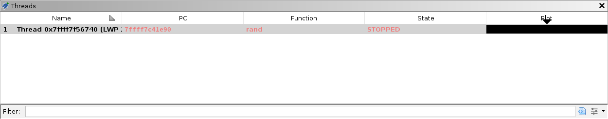
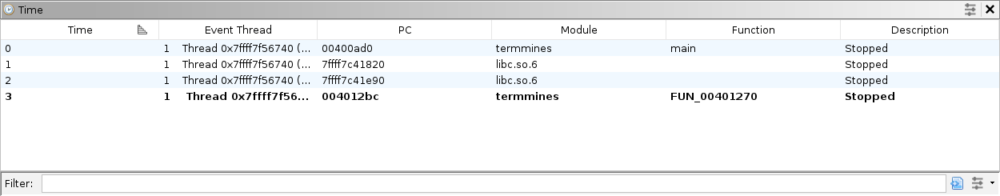

# Navigation

This module assumes you know how to launch `termmines` in Ghidra using GDB, and know where to find the basic Debugger GUI components.
It also assumes you are familiar with the concepts of breakpoints and machine state in Ghidra.
If not, please refer to the previous modules.

This module will address the following features in more depth:

* The Threads window
* The Stack window
* The Time window

## Coordinates

The term *location* is already established in Ghidra to refer to the current program and current address.
There are more elements to a "location" in a dynamic session, so we add additional elements to form the concept of your current *coordinates*.
All of these elements can affect the information displayed in other windows, especially those dealing with machine state.

* The current *trace*.
  A trace database is where all of the Debugger windows (except Targets and Objects) gather their information.
  It is the analog of the program database, but for dynamic analysis.
* The current *thread*.
  A thread is a unit of execution, either a processor core or a platform-defined virtual thread.
  Each thread has its own register context.
  In Ghidra, this means each has its own instance of the processor specification's "register" space.
* The current *frame*.
  A frame is a call record on the stack.
  For example, `main` may call `getc`, which may in turn call `read`.
  If you wish to examine the state of `main`, you would navigate 2 frames up the stack.
  Because functions often save registers to the stack, the back-end debugger may "unwind" the stack and present the restored registers.
* The current *time*.
  In general, time refers to the current snapshot.
  Whenever the target becomes suspended, Ghidra creates a snapshot in the current trace.
  If you wish to examine the machine state at a previous time, you would navigate to an earlier snapshot.
  "Time" may also include steps of emulation, but that is covered in the [Emulation](B2-Emulation.md) module.

In general, there is a window dedicated to navigating each element of your current coordinates.

## Threads

If you do not have an active session already, launch `termmines`.

The Threads window displays a list of all threads ever observed in the target.
This includes threads which have been terminated.
Unfortunately, `termmines` is a single-threaded application, so you will only see one row.
If there were more, you could switch to a different thread by double-clicking it in the table.
The columns are:

* The **Name** column gives the name of the thread.
  This may include the back-end debugger's thread id, the target platform's system thread id, and/or the back-end debugger's display text for the thread.
* The **Created** column gives the snapshot when the thread was first observed.
* The **Destroyed** column gives the snapshot when the thread was first observed as terminated.
  If this is empty, the thread is still alive.
* The **State** column gives the state of the thread.
  This may be one of ALIVE, RUNNING, STOPPED, TERMINATED, or UNKNOWN.
* The **Comment** column allows you to annotate the thread, e.g., if you discover it has a dedicated purpose.
* The **Plot** column plots the threads' life spans in a chart.

**NOTE**: Most of the time, switching threads will also change what thread is being controlled by the Control actions in the global toolbar.
This may vary subtly, depending on the action and the target.
For example, the  Resume button will usually allow all threads to execute; whereas the  Step Into button will usually step only the current thread.
If the target's thread scheduler cannot schedule your current thread, the behavior is not clearly defined:
It may step a different thread, it may cause the target to block until the thread can be scheduled, or it may do something else.

When you switch threads, everything that depends on the current thread may change, in particular the Stack window and any machine-state window that involves register values.
The Registers window will display the values for the new thread, the Watches window will re-evaluate all expressions, and the Dynamic Listing and Memory views may seek to different addresses, depending on their location tracking configurations.

### Trace Tabs

The Threads window also has a row of tabs at the very top.
This is a list of open traces, i.e., of targets you are debugging.
You can also open old traces to examine a target's machine state *post mortem*.
In general, you should only have one trace open at a time, but there are use cases where you might have multiple.
For example, you could debug both the client and server of a network application.
To switch to another trace, single-click its tab.

When you switch traces, every Debugger window that depends on the current trace will update.
That's every window except Targets and Objects.
The Breakpoints window may change slightly, depending on its configuration, because it is designed to present all breakpoints in the session.

## Stack

Ensure your breakpoint on `rand` is enabled, and resume until you hit it.

The stack window displays a list of all the frames for the current thread.
Each thread has its own execution stack, so the frame element is actually dependent on the thread element.
The call records are listed from innermost to outermost.
Here, `main` has called an unnamed function, which has in turn called `rand`.
The columns are:

* The **Level** column gives the frame number.
  This is the number of calls that must be unwound from the current machine state to reach the frame.
* The **PC** column gives the address of the next instruction in that frame.
  The PC of frame 0 is the value of the PC register.
  Then, the PC of frame 1 is the return address of frame 0, and so on.
* The **Function** column gives the name of the function containing the PC mapped to its static program database, if available.
* The **Comment** column allows you to annotate the frame.

Double-click the row with the unnamed function (frame 1) to switch to it.
When you switch frames, any machine-state window that involves register values may change.
**NOTE**: Some back-end debuggers do not recover register values when unwinding stack frames.
For those targets, some windows may display stale meaningless values in frames other than 0.

### Exercise: Name the Function

Your Dynamic and Static Listings should now be in the unknown function.
If you have not already done so, reverse engineer this function and give it a name.

## Time

Re-launch `termmines`, ensure both of your breakpoints at `srand` and `rand` are enabled, and resume until you hit `rand`, then step out.
Now, switch to the Time window.

It displays a list of all the snapshots for the current trace.
In general, every event generates a snapshot.
By default, the most recent snapshot is at the bottom.
The columns are:

* The **Snap** column numbers each snapshot.
  Other windows that indicate life spans refer to these numbers.
* The **Timestamp** column gives the time when the snapshot was created, i.e., the time when the event occurred.
* The **Event Thread** column indicates which thread caused the target to break.
  This only applies to snapshots that were created because of an event, which is most.
* The **Schedule** column describes the snapshot in relation to another.
  It typically only applies to emulator / scratch snapshots, which are covered later in this course.
* The **Description** column describes the event that generated the snapshot.

Switch to the snapshot where you hit `srand` (snapshot 2 in our screenshot) by double-clicking it in the table.
This will cause all the machine-state windows to update including the Stack window.
If you try navigating around the Dynamic Listing, you will likely find stale areas indicated by a grey background.

**NOTE**: Navigating into the past will automatically change the Control mode.
This is to avoid confusion, since you may perform a control action based on the state you see, which is no longer the state of the live target.
Switch back by using the Control mode drop-down button in the global toolbar.
When you select **Control Target** (with or without edits), the Debugger will navigate forward to the latest snapshot.

### Sparse vs. Full Snapshots

Regarding the stale areas: the Debugger cannot request the back-end debugger provide machine state from the past.
(Integration with timeless back-end debuggers is not yet supported.)
Remember, the trace is used as a cache, so it will only be populated with the pages and registers that you observed at the time.
Thus, most snapshots are *sparse* snapshots.
The most straightforward way to capture a *full* snapshot is the  Refresh button with a broad selection in the Dynamic Listing.
We give the exact steps in the next heading.
To capture registers, ensure you navigate to each thread whose registers you want to capture.

### Comparing Snapshots

A common technique for finding the address of a variable is to take and compare snapshots.
Ideally, the snapshots are taken when only the variable you are trying to locate has changed.
Depending on the program, this is not always possible, but the technique can be repeated to rule out many false positives.
The actual variable should show up in the difference every time.

For example, to find the variable that holds the number of mines, we can try to compare memory before and after parsing the command-line arguments.
Because parsing happens before waiting for user input, we will need to launch (not attach) the target.

1. Launch `termmines -M 15` in the Debugger.
   (See [Getting Started](A1-GettingStarted.md) to review launching with custom parameters.)
1. Ensure your breakpoint at `srand` is enabled.
1. Use **Ctrl-A** to Select All the addresses.
1. Click the  Refresh button.
   **NOTE**: It is normal for some errors to occur here.
   We note a more surgical approach below.
1. Wait a moment for the capture to finish.
1. Optionally, press **Ctrl-Shift-N** to rename the snapshot so you can easily identify it later.
   Alternatively, edit the snapshot's Description from the table in the Time window.
1. Press  Resume, expecting it to break at `srand`.
1. Capture another full snapshot using Select All and Refresh.
1. Click the  Compare button in the Dynamic Listing.
1. In the dialog, select the first snapshot you took.

   

1. Click OK.

The result is a side-by-side listing of the two snapshots with differences highlighted in orange.
Unlike the Static program comparison tool, this only highlights differences in *byte* values.
You can now use the Next and Previous Difference buttons in the Dynamic Listing to find the variable.

Notice that you see the command-line specified value 15 on the left, and the default value 10 on the right.
This confirms we have very likely found the variable.

**NOTE**: Using Select All to create your snapshots can be a bit aggressive.
Instead, we might guess the variable is somewhere in the `.data` section and narrow our search.
For one, including so much memory increases the prevalence of false positives, not to mention the wasted time and disk space.
Second, many of the pages in the memory map are not actually committed, leading to tons of errors trying to capture them all.
Granted, there are use cases where a full snapshot is appropriate.
Some alternatives, which we will cover in the [Memory Map](A6-MemoryMap.md) module, allow you to zero in on the `.data` section:

* Use the Memory Map window (borrowed from the CodeBrowser) to navigate to the `.data` section.
  The Dynamic Listing will stay in sync and consequently capture the contents of the first page.
  This specimen has a small enough `.data` section to fit in a single page, but that is generally not the case in practice.
* Use the Regions window to select the addresses in the `.data` section, then click Refresh in the Dynamic Listing.
  This will capture the full `.data` section, no matter how many pages.
* Use the lower pane of the Modules window to select the addresses in the `.data` section, then click Refresh in the Dynamic Listing.
  This will also capture the full `.data` section.

### Exercise: Find the Time

In `termmines`, unlike other Minesweeper clones, your score is not printed until you win.
Your goal is to achieve a remarkable score by patching a variable right before winning.
Considering it is a single-threaded application, take a moment to think about how your time might be measured.
**TIP**: Because you will need to play the game, you will need to attach rather than launch.
Use the snapshot comparison method to locate the variable.
Then place an appropriate breakpoint, win the game, patch the variable, and score 0 seconds!

If you chose a poor breakpoint or have no breakpoint at all, you should still score better than 3 seconds.
Once you know where the variable is, you can check its XRefs in the Static Listing and devise a better breakpoint.
You have completed this exercise when you can reliably score 0 seconds for games you win.

**NOTE**: If you are following and/or adapting this course using a different specimen, the timing implementation and threading may be different, but the technique still works.
