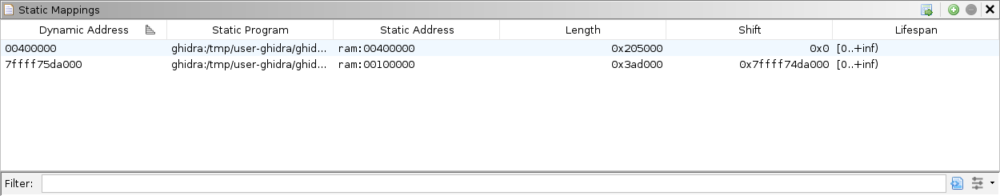

# Memory Map

This modules assumes you know how to launch `termmines` in Ghidra using GDB, and know where to find the basic Debugger GUI components.
If not, please refer to the previous modules.

This module will address the following features in more depth:

* The Regions window
* The Modules window
* The Static Mappings window

If you do not have an active session, please launch `termmines` in the Debugger.

## Regions

The Regions window displays a list of all the memory regions known to the back-end debugger.
In practice, not all targets will report this information.
The nearest analog from the CodeBrowser is the Memory Map window.
Unlike the Memory Map window, the Regions window includes all regions mapped to external modules, as well as regions allocated for stacks, heaps, or other system objects.
The columns are:

* The **Name** column gives the name of the region.
  For file-backed mappings, this should include the name of the file.
  It may or may not include a section name.
  Typically, the name will include the start address to avoid collisions.
* The **Start** column gives the minimum address of the region.
* The **End** column gives the maximum (inclusive) address of the region.
* The **Length** column gives the number of bytes in the region.
* The **Read**, **Write**, and **Execute** columns give the permissions of the region.

Try using the filter and column headers to sift and sort for interesting regions.
Double-click the start or end address to navigate to them in the Dynamic Listing.
Select one or more regions, right-click, and choose **Select Addresses**.
That should select all the addresses in those regions in the Dynamic Listing.
Used with the **Read Memory** button in the Dynamic Listing, you can selectively capture memory into the current snapshot.

## Modules

The Modules window has two panes, though the second is disabled by default.
The top pane displays a list of all the *modules* known to the back-end debugger.
The bottom pane displays a list of all the *sections* known to the back-end debugger.
In practice, not all targets will report module information.
Fewer targets report section information, and those that do may only report them to Ghidra when specifically requested.
The nearest analog to the bottom panel from the CodeBrowser is (also) the Memory Map window.
The top panel has no real analog; however, the tabs above the Static Listing pane serve a similar purpose.

For a target that reports section information, the bottom panel will display a lot of the same information as the Regions window.
The columns differ slightly, and the sections panel will *not* include stacks, heaps, etc.

The module columns are:

* The **Base** column gives the image base for the module.
  This should be the minimum address of the module.
* The **Max** column gives the maximum address of the module.
* The **Name** column gives the (short) name of the module.
* The **Mapping** column gives the mapped Ghidra program database for the module.
* The **Length** column gives the distance between the base and max address (inclusive).
  Note that not every address between base and max is necessarily mapped to the module.
  ELF headers specify the load address of each section, so the memory footprint usually has many gaps.

See the Help (press **`F1`** in the Modules panel) to learn more about the Sections table, if desired.
It can be enabled using the **Show Sections Table** button in the local toolbar.

Double-click any address to navigate to it.
Make a selection of modules or sections, right-click, and choose **Select Addresses**.
Again, combined with the Dynamic Listing's **Read Memory** button, you can capture memory selectively.

## Optional Exercise: Find the Time Surgically

Repeat the "Find the Time" exercise from the previous module, but use the Modules and Regions windows to form a more surgical selection for capturing into the snapshots.

## Static Mappings

The Static Mappings window provides user access to the trace's static mapping table.
There are two ways to open the window:

1. In the menu: **Window &rarr; Debugger &rarr; Static Mappings**.
1. From the Modules window, click Map Manually in the local toolbar.

Each row in the table is a range of mapped addresses.
The columns are:

* The **Dynamic Address** column gives the minimum dynamic address in the mapped range.
* The **Static Program** column gives the Ghidra URL of the static image.
* The **Static Address** column gives the minimum static address in the mapped range.
* The **Length** column gives the number of bytes in the range.
* The **Shift** column gives the difference in address offsets from static to dynamic.
* The **Lifespan** column gives the span of snapshots for which this mapped range applies.

The Ghidra Debugger relies heavily on Module information to synchronize the listings and to correlate its static and dynamic knowledge.
Instead of using the module list directly for this correlation, it populates a *static mapping* table.
This permits other sources, including user overrides, to inform the correlation.
By default, whenever a new program is opened and/or imported, the Debugger will attempt to match it to a module in the trace and map it.
Furthermore, when you navigate to an address in a module that it is not yet mapped to a program, it will search your project for a match and open it automatically.
You may notice the two address columns, as well as the shift column.
This illustrates that the Debugger can recognize and cope with module relocation, especially from ASLR.

There are many ways to manually override the mappings:

* From the Modules window, select one or more modules, and choose from the **Map Module** actions.
  Selecting a single module at a time, it is possible to surgically map each to a chosen program.
* From the Sections panel, select one or more sections, and choose from the **Map Section** actions.
  This is certainly more tedious and atypical, but it allows the surgical mapping of each section to a chosen memory block from among your open programs.
* From the Regions window, select one or more regions, and choose from the **Map Region** actions.
* Click the **Map Identically** button in the Modules window toolbar.
* Use the **Add** and **Remove** buttons in the Static Mappings window toolbar.

These methods are not described in detail here.
For more information, hover over the relevant actions and press **`F1`** for help.

## Moving Knowledge from Dynamic to Static

There are occasions when it is necessary or convenient to transfer data or markup from the dynamic session into a static program database.
For example, suppose during experimentation, you have placed a bunch of code units in the Dynamic Listing.
You might have done this because the memory is uninitialized in the Static Listing, and you preferred some trial and error in the Dynamic Listing, where the memory is populated.
In this case, you would want to copy those code units (though not necessarily the byte values) from the Dynamic Listing into the Static Listing.
After selecting the units to copy, you would use **Debugger &rarr; Copy Into Current Program** in the menus.

In another example, you might not have an on-disk image for a module, but you would still like to perform static analysis on that module.
In this case, you would want to copy everything within that module from the dynamic session into a program database.
After selecting the addresses in that module, you would use **Debugger &rarr; Copy Into New Program**.

For demonstration, we will walk through this second case, pretending we cannot load `libncurses` from disk:

1. In the top pane of the Modules window, right-click `libncurses` and choose **Select Addresses**.
   (Do not click **Import From File System**, since we are pretending you cannot.)
1. Change focus to the Dynamic Listing.
1. In the global menu, choose **Debugger &rarr; Copy Into New Program**.

   

1. Keep **Destination** set to "&lt;New Program&gt;."
1. Ensure **Read live target's memory** is checked.
   This will spare you from having to create a full snapshot manually.
1. Do *not* check **Use overlays where blocks already exist**.
   It should not have any effect for a new program, anyway.
1. It is probably best to include everything, though **Bytes** is the bare minimum.
1. The table displays the *copy plan*.
   For a new program, this will copy with an identical mapping of addresses, which is probably the best plan, since the target system has already applied fixups.
   Do not change any addresses, lest your corrupt references in the copy.
1. Click **Copy**.
1. When prompted, name the program `libncurses`.
1. You may need to click the `termmines` tab in the Static Listing to get the UI to completely update.
1. Click back over to `libncurses` and save the program.
   If you are prompted to analyze, go ahead.

Undoubtedly, we would like to map that new program into our dynamic session.

1. Ensure that the new `libncurses` capture is still the current program.
1. In the top pane of the Modules window, right-click `libncurses` and choose **Map to libncurses**.
1. Check the proposed mapping and click **OK**.

## Exercise: Export and Map `ncurses`

Repeat this technique for the "system-supplied DSO" module.
In practice, there is no real reason to do this, but this particular module prevents you from using **Import From File System**.

## Exercise: Cheat Like the Devs

This concludes the portion on the basic features of the Ghidra Debugger.
Now, let's put your new knowledge to good use!

The developers left a cheat code in `termmines`.
Your goal is to figure out the cheat code, determine what it does, and describe how it is implemented.
If you have already stumbled upon this cheat, you must still explain how it is implemented.
