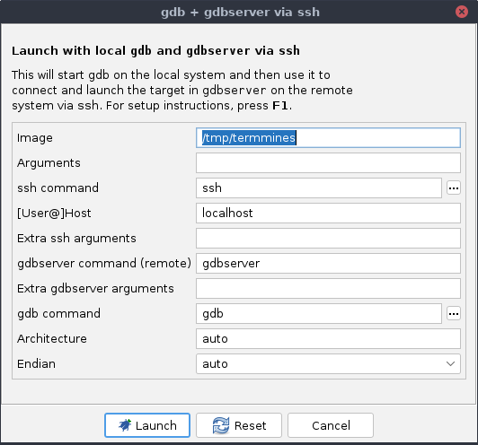
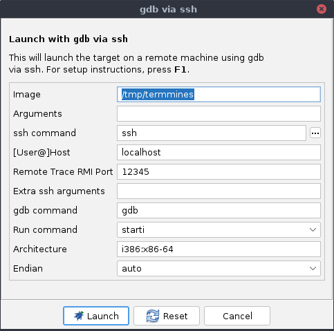

# Remote Targets

This is the first module of the Advanced part of this course.
It assumes you have completed the Beginner portion.
At the very least, you should complete [Getting Started](A1-GettingStarted.md) and [A Tour of the Debugger UI](A2-UITour.md) first.

## Module Mapping Caveats

Beware!
Many of the conveniences in Ghidra assume that the target is running from the same file system as Ghidra, which will not be the case when the target is remote.
Be sure your current project is populated only with programs imported from the target's file system.
Additionally, if prompted to import something new, be sure to redirect to the remote file system, because the dialog will default to the path on the local file system.

## Variation in Configuration

There are a number of configurations for remote debugging with many moving parts.
Some of those parts are contributed by Ghidra's Debugger, some are not.
Depending on your particular target and platform, there may be several options available to you.
Consider a remote Linux target in user space.
While this list is not exhaustive, some options are:

 * Use `gdbserver` over SSH
 * Use Trace RMI over SSH
 * Use `gdbserver` and connect to it manually
 * Connect Trace RMI manually

Generally, for each of these options it boils down to which components will be colocated with the target and which will be colocated with Ghidra.

## Using `gdbserver` over SSH

In this configuration, Ghidra and GDB will be located in the user's local environment, while `gdbserver` and the specimen will be located in the target environment.
We will connect the local `gdb` to the remote `gdbserver` by forwarding stdio over SSH.

1. First, prepare the target, which for demonstration purposes has the IP address 10.0.0.1.
   Generally, this just means booting it up and ensuring it has `gdbserver` installed.
   **NOTE**: You do not need to run `gdbserver` or the target binary.
   The launcher will do that for you.
1. From the launch menu, select **gdb + gdbserver via ssh**.

   

1. Read the wall of text, at least the first time, and verify the remote system is prepared.
1. Fill out the options appropriately.
   Notably, correct the location of the target image to point at its location on the *target* system.
   Enter "user@10.0.0.1" for the **[User@]Host** option, substituting your username for the remote system.
1. Click **Launch**.

At this point, most things will work the same as they would for a local target.

## Using Trace RMI over SSH

In this configuration, Ghidra will be located in the user'ls local environment, while `gdb` and the specimen will be located in the target environment.
Notice that we are *not* using `gdbserver`.
We will connect the local Ghidra to the remote `gdb` by forwarding Trace RMI over SSH.
See the help (press **`F1`** on the **gdb via ssh** menu item for advantages and disadvantages of using this vs. `gdbserver`.)

1. First, prepare the target.
   This is more involved than using `gdbserver`, since you will need to ensure `gdb` and the Trace RMI plugin for it are installed.
   The packages, which should be included with Ghidra, are `ghidratrace` and `ghidragdb`, but you may need to build them first.
   If you installed `gdb` and `python3` from your distribution's repositories, installation of the Python packages should be straightfoward.
   Search the Ghidra installation for files ending in `.whl`.
   If the `ghidratrace` and `ghidragdb` packages are there, you can skip this build step and just transfer them to the target.
   On the local system:

   ```bash
   python3 -m pip install build # unless you already have it
   cd /path/to/ghidra/Ghidra/Debug/Debugger-rmi-trace/pypkg
   python3 -m build
   ```

   This will output `.tar.gz` and `.whl` files under `pypkg/dist`.
   Do the same for `Debugger-agent-gdb/pypkg`.
   Transfer the resulting `.whl` files to the target, then on the target system:

   ```bash
   python3 -m pip install /path/to/ghidratrace-[version].whl /path/to/ghidragdb-[version].whl
   ```

   If you are offline, the dependencies are included in the `pypkg/dist` directory for each module.
   Transfer and install them, too.
   You may try `python -m pip install --no-index -f /path/to/packages ghidragdb`, if all the packages and dependencies are in the one directory.
   Chances are, GDB embeds the same Python, so they become importable from GDB.
   Test using `gdb` on the target system:

   ```gdb
   python import ghidragdb
   ```

   No news is good news!
   You can quit GDB, since that was just for verifying the installation.

1. From the launch menu, select **gdb via ssh**.

   

1. Fill out the options appropriately.
   Notably, correct the location of the target image to point at its location on the *target* system.
   Enter "user@10.0.0.1" for the **[User@]Host** option, substituting your username for the remote system.
1. Click **Launch**.

At this point, most things will work the same as they would for a local target.

### Troubleshooting

#### I can't find the Python packages to install

You may need to build them using the instructions above.
The dependencies are included in the Ghidra installation, but perhaps something has gone missing.
Search for files ending in `.whl` or `.tar.gz`; they should be located in `pypkg/dist` in various modules.
If you are able to do local debugging with Ghidra and `gdb`, then the source is definitely present and functioning.
To (re-)build the packages from source:

```bash
python3 -m pip install build
cd /path/to/ghidra/Ghidra/Debug/Debugger-rmi-trace/pypkg
python3 -m build
```

This should output a `.tar.gz` and a `.whl` file under `pypkg/dist`.
Send the `.whl` over to the target system and `pip install` it.
Do the same for Debugger-agent-gdb.
If that doesn't work, then in the worst case, copy the Python source over and add it to your `PYTHONPATH`.

#### The `python import ghidragdb` command fails

Double-check that you have installed all the required packages and their dependencies.
A common forgotten or incorrectly-versioned dependency is `protobuf`.
We developed using `protobuf==3.20.3`.
Its "sdist" package is distributed with Ghidra under `Debugger-rmi-trace/pypkg/dist` for your convenience.

It is also possible that `gdb` has embedded a different version of the interpreter than the one that `python3` provides.
This can happen if you built GDB or Python yourself, or you installed them from a non-standard repository.
Check the actual path of the Python library used by `gdb`:

```bash
ldd $(which gdb)
```

Or, inside `gdb`:

```gdb
(gdb) python-interactive
>>> import sys
>>> sys.version
```

Suppose this identifies version 3.7.
Retry the installation commands using `python3.7 -m pip ...`.
If you have multiple copies of the same version in different locations, you may need to invoke `python3` using its complete path.

In the worst case, copy the Python source over and add it to your `PYTHONPATH`.

## Using `gdbserver` manually

The configuration and result here are similar using `gdbserver` over SSH, but will be performed manually.

1. First, prepare the target.
   This time, you will need to start `gdbserver` on the remote system manually.
   For demonstration, we will listen on 10.0.0.1 port 12345:

   ```bash
   gdbserver 10.0.0.1:12345 termmines
   ```

1. From the launch menu, select **remote gdb**.
1. Fill out the options appropriately.
   Notably, enter "10.0.0.1" for the **Host** option, and "12345" for the **Port** option.
1. Click **Launch**.

At this point, most things will work the same as they would for a local target.

## Connecting Trace RMI manually

The configuration and result here are similar to using Trace RMI over SSH, but will be performed manually.

1. First, prepare the target.
   Follow the same installation steps as above for Trace RMI over SSH, if you have not already.
1. In Ghidra's Connections window, click **Accept a single inbound TCP connection** in the local toolbar.

   

1. Set **Host/Address** to "10.0.0.1", so that we can connect to it over the network.
   **NOTE**: You may leave the port as "0" or pick a specific port, assuming you have permission to use it.
1. Click **Listen**, and then take note of the acceptor's port number in the Connections window, e.g., "12345."
1. Now, on the remote system, start `gdb` and type:

   ```gdb
   python import ghidragdb
   file termmines
   # set args, if you'd like
   ghidra trace connect 10.0.0.1:12345
   ghidra trace start
   ghidra trace sync-enable
   starti
   ```

At this point, most things will work the same as they would for a local target.
You may notice Ghidra has not given you a new terminal.
Just use the one you already have on the remote target.

A notable advantage of this configuration is that you can enter whatever `gdb` commands you want to start your target.
Here we demonstrated the simplest case of a "native" target.
It is also possible to use this procedure to connect Ghidra into a running `gdb` session.

## Rube Goldberg Configurations

While you should always prefer the simpler configuration, it is possible to combine components to meet a variety of needs.
For example, to debug a native Android target from Windows, you could run Ghidra on Windows, connect it to GDB via SSH to a Linux virtual machine, e.g., WSL2, and then connect that to `gdbserver` running in an Android emulator.

## Exercise: Debug your Friend's `termmines`

If you are in a classroom setting, pair up.
Otherwise, play both roles, preferably using separate machines for Ghidra and the target.
Using one of the above procedures, debug `termmines`.
One of you should prepare the target environment.
The other should connect to it and launch the specimen.
Then trade roles, choose a different procedure, and do it again.
