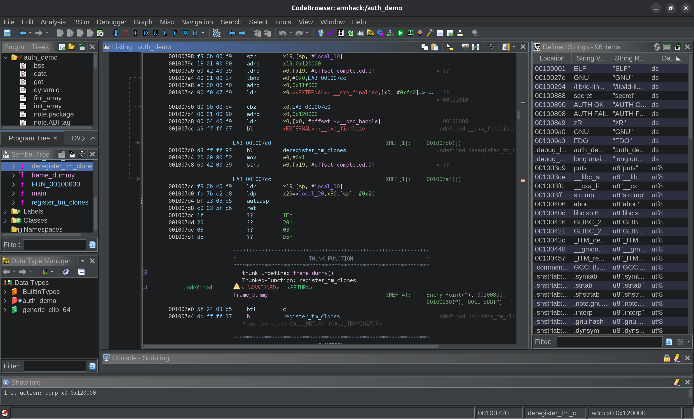
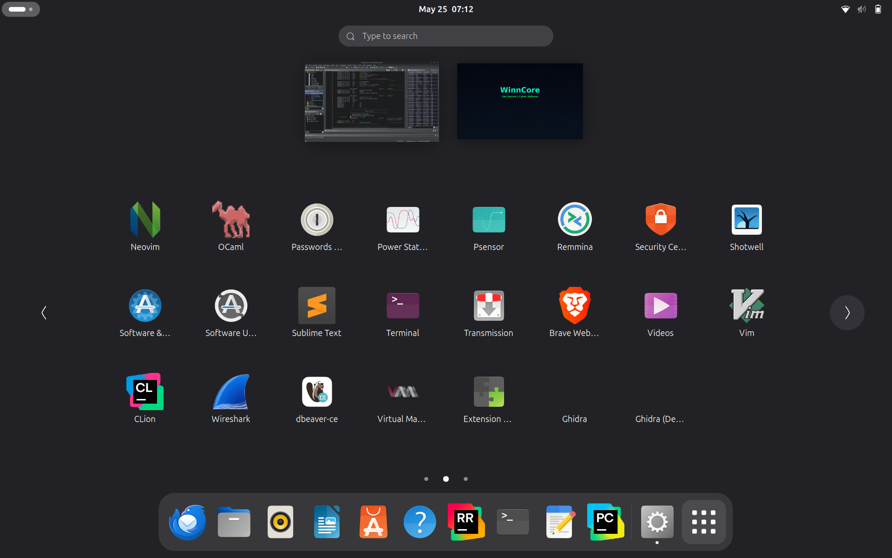

# Ghidra Linux HiDPI Launcher

A Linux `.desktop` launcher for starting Ghidra with Java UI-scaling and font-antialiasing options, so the CodeBrowser stays readable on high-DPI displays.

This is part of the [WinnCore/ghidra](https://github.com/WinnCore/ghidra) fork of [NSA's Ghidra](https://github.com/NationalSecurityAgency/ghidra). Custom additions live under `custom/`. Developed on a Lenovo ThinkPad X13s ARM64; adaptable to any Linux machine.

## Screenshots



*Ghidra running with the HiDPI launcher. Java/Swing UI scaled via `-Dsun.java2d.uiScale=2.5` with font antialiasing enabled.*



*Application menu after install. The blank icon and duplicate "Ghidra" entries are cosmetic issues — see [Known issues](#known-issues).*

## Quick start

For users who already understand `.desktop` files:

```bash
# 1. Grab the launcher template
curl -O https://raw.githubusercontent.com/WinnCore/ghidra/hidpi-launcher-arm64/custom/launchers/linux-hidpi/ghidra-hidpi-template.desktop

# 2. Move it into your applications directory
mv ghidra-hidpi-template.desktop ~/.local/share/applications/ghidra-hidpi.desktop

# 3. Edit Exec=, Icon=, and Name= for your Ghidra install
nano ~/.local/share/applications/ghidra-hidpi.desktop

# 4. Refresh the menu
update-desktop-database ~/.local/share/applications/ 2>/dev/null || true
```

Detailed steps and troubleshooting are below.

## Why this exists

Ghidra is a Java/Swing application. On some Linux desktop environments, especially high-DPI displays, the interface renders too small for comfortable reverse-engineering work.

This launcher fixes that by passing Java display options to the JVM at startup. It does not modify Ghidra source code — it only changes how Ghidra is launched.

## What it changes

The launcher starts Ghidra with these Java options:

| Option | Purpose |
|---|---|
| `-Dsun.java2d.uiScale=2.5` | Scales the Java/Swing interface. |
| `-Dswing.aatext=true` | Enables antialiased text rendering. |
| `-Dawt.useSystemAAFontSettings=on` | Uses system font-smoothing settings. |

These options are passed via `env _JAVA_OPTIONS=...` inside the launcher's `Exec=` line, so they only affect Ghidra processes started by this launcher — other Java applications on your system are unaffected.

## Files

| File | Purpose |
|---|---|
| `ghidra-hidpi-template.desktop` | Portable launcher template — copy this and edit a few lines to use it. |
| `Ghidra.desktop` | Reference example: a working launcher for an installed ARM64 Ghidra build. |
| `ghidra-dev.desktop` | Reference example: a working launcher for a Ghidra development build. |

Only `ghidra-hidpi-template.desktop` is intended for direct use. The two reference examples show how the paths look on a real machine.

## Install on your own Linux system

### 1. Find your Ghidra install

```bash
find ~ /opt -name ghidraRun 2>/dev/null
```

Common results:

```text
/opt/ghidra-11.4.1/ghidraRun
~/Downloads/ghidra_11.x_PUBLIC/ghidraRun
~/ghidra/ghidraRun
```

Also find the icon:

```bash
find ~ /opt -path "*support/ghidra.png" 2>/dev/null
```

### 2. Get the launcher template

Either clone the repo:

```bash
git clone https://github.com/WinnCore/ghidra.git
cd ghidra
git checkout hidpi-launcher-arm64
cd custom/launchers/linux-hidpi
```

Or download just the template file:

```bash
curl -O https://raw.githubusercontent.com/WinnCore/ghidra/hidpi-launcher-arm64/custom/launchers/linux-hidpi/ghidra-hidpi-template.desktop
```

### 3. Copy the template into place

```bash
cp ghidra-hidpi-template.desktop ~/.local/share/applications/ghidra-hidpi.desktop
```

### 4. Edit the copied launcher

```bash
nano ~/.local/share/applications/ghidra-hidpi.desktop
```

Change these three lines:

```text
Name=Ghidra (HiDPI)
Exec=env _JAVA_OPTIONS="-Dsun.java2d.uiScale=2.5 -Dswing.aatext=true -Dawt.useSystemAAFontSettings=on" "/CHANGE/ME/path/to/ghidraRun"
Icon=/CHANGE/ME/path/to/support/ghidra.png
```

Example:

```text
Name=Ghidra (HiDPI)
Exec=env _JAVA_OPTIONS="-Dsun.java2d.uiScale=2.5 -Dswing.aatext=true -Dawt.useSystemAAFontSettings=on" "/opt/ghidra-11.4.1/ghidraRun"
Icon=/opt/ghidra-11.4.1/support/ghidra.png
```

The distinct `Name=` avoids a duplicate "Ghidra" menu entry alongside any installer-dropped launcher.

### 5. Refresh the application menu

```bash
update-desktop-database ~/.local/share/applications/ 2>/dev/null || true
```

If it does not appear, log out and log back in.

### 6. Verify it worked

Launch "Ghidra (HiDPI)" from your application menu. Ghidra should open looking like the first screenshot above — substantially larger UI with antialiased text. If text is still small, see [Tuning the scale](#tuning-the-scale). If it doesn't launch, see [Troubleshooting](#troubleshooting).

## Tuning the scale

| Display                        | Suggested value |
| ------------------------------ | --------------- |
| 1080p laptop                   | `1.25` or `1.5` |
| 2K laptop display              | `2.0`           |
| ThinkPad X13s built-in display | `2.5`           |
| 4K monitor                     | `2.5` or `3.0`  |

Edit `-Dsun.java2d.uiScale=2.5` in your installed `.desktop` file, then relaunch Ghidra.

## Known issues

Two cosmetic issues, both fixable in the `.desktop` file:

- **Blank launcher icon.** The template ships with a placeholder `Icon=` path that won't exist on your machine. Edit it to point at your actual `ghidra.png` (typically `support/ghidra.png` inside your Ghidra install).
- **Duplicate "Ghidra" menu entries.** The template uses `Name=Ghidra`, which collides with installer-dropped Ghidra entries. Change it to `Name=Ghidra (HiDPI)` or similar.

After editing, re-run `update-desktop-database ~/.local/share/applications/` to refresh.

## Troubleshooting

### Launcher does not appear

```bash
update-desktop-database ~/.local/share/applications/ 2>/dev/null || true
```

Then log out and log back in.

### Ghidra does not start

```bash
ls -l /path/to/ghidraRun
chmod +x /path/to/ghidraRun
```

### Scale is too large or too small

Edit `-Dsun.java2d.uiScale=2.5` — try `1.5`, `2.0`, `2.5`, or `3.0`.

### Fonts still look rough

```bash
gsettings get org.gnome.desktop.interface font-antialiasing
fc-match
```

### Decompiler text is still too small

Some Ghidra views have their own font settings. Open the Ghidra tool options and increase the font size for Listing or Decompiler views.

## Developed on

* Lenovo ThinkPad X13s Gen 1
* ARM64 / AArch64 Linux
* GNOME desktop environment
* Ghidra 11.x and a local Ghidra development build

If you've used this launcher on other hardware (other ARM64 boards, other desktop environments), open an issue and I'll add your configuration here.

## Related

For notes on visual reverse-engineering workflow in Ghidra (color-coding, function naming, review strategy), see [`custom/docs/visual-analysis-workflow.md`](../../docs/visual-analysis-workflow.md).

## Notes

This is a launcher/configuration usability shim, not a Ghidra plugin or extension. It belongs under `custom/launchers/`, not `Ghidra/Extensions/`.

## License

This launcher folder is licensed under [Apache 2.0](https://www.apache.org/licenses/LICENSE-2.0), matching the Ghidra upstream license.
